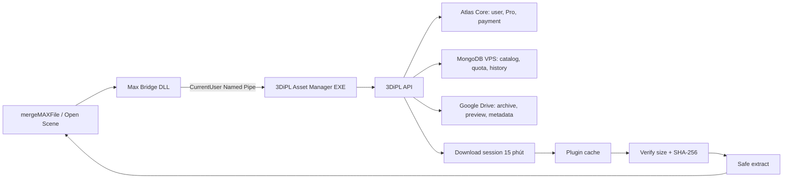

# 3DiPL 3ds Max Plugin Development Guide

> **Contract hiện hành:** xem [`docs/PLUGIN_API.md`](docs/PLUGIN_API.md). Tài liệu
> này mô tả kiến trúc sản phẩm ở mức cao; route, DTO, error code, security và release
> feed phải tuân theo `PLUGIN_API.md` và các suite `backend/test/plugin-*.test.js`.

## 1. Mục tiêu

Plugin cho phép người dùng đăng nhập 3DiPL, tìm Model/Scene, tải file vào cache cục bộ và:

- Model: giải nén, kiểm tra SHA-256 rồi merge file `.max` vào scene hiện tại.
- Scene: tải và mở một bản sao an toàn; không tự ghi đè scene đang làm việc.
- Dùng chung tài khoản, gói Pro, quota và lịch sử với website.
- Một lượt tải Model tốn `1`, một lượt tải Scene tốn `5`.
- Không để lộ Google Drive file ID, refresh token hoặc link quản trị Drive.

## 2. Trạng thái backend hiện tại

| Hạng mục | Trạng thái |
| --- | --- |
| Catalog Model/Scene public | Đã có |
| Cover/preview proxy | Đã có |
| Route download riêng cho plugin | Đã có |
| Quota, Pro, log `clientType=plugin` | Đã có |
| Download session 15 phút, SHA-256 | Đã có |
| Device login/Bearer token cho plugin | Đã có |
| Turnstile challenge dành cho plugin | Đã có, one-time và gắn operation |
| API phiên bản plugin/update manifest | Đã có manifest V2 + ETag + ES256 |

Không phát hành plugin production bằng cách nhúng cookie web hoặc secret của server
vào DLL. Production chỉ được bật sau Staging E2E, Authenticode và ES256 release
signature hợp lệ.

## 3. Kiến trúc



## 4. Công nghệ và phiên bản

- Ngôn ngữ khuyến nghị: C#.
- UI: WPF Desktop EXE độc lập; trong Max chỉ giữ bridge DLL nhỏ, không chứa HTTP,
  SQLite, token hoặc WPF shell.
- HTTP: một `HttpClient` dùng xuyên suốt ứng dụng, không tạo mới cho từng request.
- JSON: `System.Text.Json`.
- Archive: SharpCompress hoặc thư viện đã được kiểm chứng; không tự viết parser ZIP/RAR/7z.
- 3ds Max 2022-2025: build riêng theo SDK tương ứng, thường dùng .NET Framework 4.8.
- 3ds Max 2026: build riêng theo SDK 2026/.NET 8.
- Không dùng chung một DLL SDK cho mọi phiên bản Max nếu Autodesk xác định binary incompatible.

Đề xuất solution:

```text
/src
  /ThreeDiPL.Core          API client, DTO, cache, checksum
  /ThreeDiPL.MaxAdapter    MAXScript/Autodesk.Max bridge
  /ThreeDiPL.UI            WPF view, view model
  /ThreeDiPL.Plugin        entry point theo từng Max SDK
/tests
  /ThreeDiPL.Core.Tests
  /ThreeDiPL.IntegrationTests
/installer
  PackageContents.xml
```

## 5. Cấu hình plugin

File người dùng:

```text
%LOCALAPPDATA%\3DiPL\Plugin\settings.json
%LOCALAPPDATA%\3DiPL\Plugin\cache\
%LOCALAPPDATA%\3DiPL\Plugin\logs\
```

Ví dụ `settings.json`:

```json
{
  "apiBaseUrl": "https://3dipl.org",
  "cacheMaxGb": 30,
  "downloadConcurrency": 2,
  "keepArchives": false,
  "language": "vi",
  "theme": "system"
}
```

Không lưu access token/refresh token trong file JSON. Mã hóa token theo Windows DPAPI, scope `CurrentUser`.

## 6. Authentication bắt buộc bổ sung

### 6.1 Device authorization flow

Plugin không nên mở Google OAuth trong embedded WebView. Backend cần thêm:

```http
POST /api/plugin/auth/device/start
Content-Type: application/json

{
  "deviceName": "WORKSTATION-01",
  "pluginVersion": "1.0.0",
  "maxVersion": "2025"
}
```

Response:

```json
{
  "deviceCode": "opaque-secret",
  "userCode": "ABCD-EFGH",
  "verificationUri": "https://3dipl.org/plugin/activate",
  "verificationUriComplete": "https://3dipl.org/plugin/activate?code=ABCD-EFGH",
  "expiresIn": 600,
  "interval": 5
}
```

Plugin mở `verificationUriComplete` bằng browser mặc định. Người dùng đăng nhập Google trên web và xác nhận thiết bị.

Plugin poll:

```http
POST /api/plugin/auth/device/token
Content-Type: application/json

{ "deviceCode": "opaque-secret" }
```

Các trạng thái: `authorization_pending`, `slow_down`, `expired_token`, `access_denied`, hoặc:

```json
{
  "accessToken": "opaque-or-jwt",
  "expiresIn": 900,
  "refreshToken": "rotating-secret",
  "user": {
    "id": "...",
    "name": "...",
    "avatar": "...",
    "isPro": true,
    "proUntil": "...",
    "credit": 0,
    "downloadQuota": {
      "used": 8,
      "limit": 100,
      "remaining": 92,
      "resetAt": "..."
    }
  }
}
```

Thêm:

```http
POST   /api/plugin/auth/refresh
DELETE /api/plugin/auth/session
GET    /api/plugin/me
```

Mọi API plugin private dùng:

```http
Authorization: Bearer <accessToken>
X-3DiPL-Plugin-Version: 1.0.0
X-3DiPL-Max-Version: 2025
```

Access token sống khoảng 15 phút. Refresh token phải rotate, hash trong DB, revoke theo thiết bị và không dùng được sau logout.

### 6.2 CSRF

CSRF chỉ dành cho cookie browser. Request có Bearer token hợp lệ phải đi qua middleware plugin riêng và không phụ thuộc cookie `csrfSecret`.

Route `/api/plugin/*` hiện dùng `pluginBearerAuth` riêng và được mount trước global
CSRF. Route `/api/plugin-activation/*` tiếp tục dùng cookie web + CSRF cho thao tác
approve/deny/revoke.

## 7. Catalog API

Base URL production:

```text
https://3dipl.org
```

Các API đã có:

```http
GET /api/marketplace/models
GET /api/marketplace/scenes
GET /api/marketplace/categories
GET /api/marketplace/scenes/categories
GET /api/marketplace/filters
GET /api/marketplace/scenes/filters
GET /api/marketplace/models/:slug
GET /api/marketplace/scenes/:slug
GET /api/marketplace/models/:id/cover
GET /api/marketplace/scenes/:id/cover
GET /api/marketplace/models/:id/preview/:index
GET /api/marketplace/scenes/:id/preview/:index
GET /api/marketplace/taxonomy/export?assetType=all
```

List hỗ trợ tối thiểu:

```text
q, page, category, access, style, renderer, form, color, material, sort
```

Sort:

```text
relevance, newest, popular, oldest, title_asc, title_desc
```

Plugin phải lấy taxonomy từ API export và cache theo `ETag`. Metadata chỉ lưu key tiếng Anh; nhãn hiển thị lấy theo `labelVi`/`labelEn`.

DTO catalog cần dùng:

```json
{
  "_id": "Mongo object id",
  "assetType": "model",
  "title": "Amoebe Armchair",
  "slug": "amoebe-armchair",
  "categorySourceId": "arm-chair",
  "parentCategorySourceId": "furniture",
  "coverImage": {
    "url": "/api/marketplace/models/:id/cover",
    "width": 1200,
    "height": 1200,
    "size": 1551443
  },
  "previewImages": [],
  "renderers": ["corona"],
  "styles": ["modern"],
  "forms": ["rectangle"],
  "colors": ["grey"],
  "materials": ["fabric"],
  "accessType": "member",
  "fileSize": 77594624,
  "downloadCount": 1284,
  "quotaCost": 1
}
```

Luôn nối URL tương đối với `apiBaseUrl`. Không suy ra hoặc lưu Drive ID.

## 8. Download contract

Model:

```http
POST /api/plugin/models/:id/download-session
Authorization: Bearer <token>
```

Scene:

```http
POST /api/plugin/scenes/:id/download-session
Authorization: Bearer <token>
```

Response hiện tại:

```json
{
  "session": {
    "_id": "...",
    "expiresAt": "...",
    "fileName": "amoebe-armchair.zip",
    "fileSize": 77594624,
    "sha256": "hex"
  },
  "downloadUrl": "/api/download/session/:id/file?t=opaque",
  "remaining": 99,
  "quotaCost": 1,
  "resetAt": "..."
}
```

Quy tắc:

1. Server quyết định `quotaCost`; không tin giá trị client gửi.
2. Download URL sống 15 phút.
3. Bật redirect trong `HttpClientHandler`; backend có thể trả `302` sang link tải Drive ngắn hạn.
4. Tải vào file `*.partial`, không ghi trực tiếp vào tên cuối.
5. Hỗ trợ resume chỉ khi response có `Accept-Ranges`; nếu URL/session hết hạn phải xin session mới theo chính sách server.
6. Kiểm tra `fileSize` và SHA-256 trước khi rename file.
7. Chỉ sau verify mới giải nén.
8. Retry cùng session không được tạo thêm lịch sử hoặc trừ quota lần nữa.

Không log query token của `downloadUrl`.

## 9. Turnstile và chống bot

Web đang xác minh Turnstile khi tạo download session. Route plugin hiện không chạy Turnstile.

Plugin production nên dùng:

- Device token gắn user, thiết bị và phiên bản plugin.
- Rate limit theo user/device/IP.
- Chữ ký request hoặc DPoP-style proof cho request nhạy cảm.
- Khi server đánh dấu rủi ro, trả:

```json
{
  "code": "CHALLENGE_REQUIRED",
  "verificationUrl": "https://3dipl.org/plugin/verify?challenge=...",
  "expiresAt": "..."
}
```

Plugin mở browser mặc định. Turnstile thành công tạo approval một lần, ràng buộc `userId + deviceId + assetId`, sau đó plugin gọi lại download-session. Không nhúng Turnstile secret key vào plugin.

## 10. Cache và giải nén an toàn

Cache key:

```text
{assetType}/{assetId}/{sha256}/
```

Cấu trúc:

```text
archive.zip
extracted/
manifest.local.json
```

Phải chặn Zip Slip:

```csharp
var root = Path.GetFullPath(extractRoot) + Path.DirectorySeparatorChar;
var target = Path.GetFullPath(Path.Combine(extractRoot, entryPath));
if (!target.StartsWith(root, StringComparison.OrdinalIgnoreCase))
    throw new InvalidDataException("Archive entry escapes cache root.");
```

Giới hạn:

- Không giải nén symlink/reparse point.
- Giới hạn tổng dung lượng sau giải nén.
- Giới hạn số file và độ dài path.
- Không chạy `.exe`, `.bat`, `.cmd`, `.ps1`, `.dll` trong archive.
- Cache dọn theo LRU; không xóa file đang được merge/open.

## 11. Chọn file `.max`

Backend nên bổ sung `mainMaxFile` vào download-session. Trong khi chưa có:

1. Nếu archive chỉ có một `.max`, dùng file đó.
2. Nếu có file trùng basename archive, ưu tiên file đó.
3. Nếu có nhiều `.max`, bắt người dùng chọn; không đoán ngẫu nhiên.

## 12. Merge Model

Thực thi trên main UI thread của 3ds Max. Gọi MAXScript qua bridge:

```maxscript
local merged = #()
local ok = mergeMAXFile @"C:\...\model.max" \
  #select \
  #autoRenameDups \
  #useMergedMtlDups \
  #alwaysReparent \
  quiet:true \
  missingExtFilesAction:#logmsg \
  missingDLLsAction:#logmsg \
  mergedNodes:&merged
```

Sau merge:

- Giữ undo chunk khi SDK/Max version hỗ trợ an toàn.
- Chọn các node vừa merge.
- Không tự move về origin nếu metadata không yêu cầu.
- Hiển thị danh sách missing textures/plugin DLL.
- Không sửa render settings của scene hiện tại.

## 13. Mở Scene

Scene không nên merge mặc định. Quy trình:

1. Cảnh báo nếu scene hiện tại chưa lưu.
2. Copy file `.max` từ cache sang thư mục làm việc do user chọn.
3. Mở bản copy bằng API/MaxScript.
4. Không sửa file cache gốc.
5. Có action phụ `Merge scene` nhưng phải yêu cầu xác nhận.

## 14. Error contract

Plugin phải xử lý theo `code`, không parse câu thông báo:

| HTTP/code | Hành động |
| --- | --- |
| `401 AUTH_REQUIRED` | Refresh token hoặc đăng nhập lại |
| `403 PRO_REQUIRED` | Mở `/topup?mode=pro` |
| `403 CHALLENGE_REQUIRED` | Mở verification URL |
| `409` metadata/file chưa sẵn sàng | Không retry liên tục |
| `410` session hết hạn | Xin download session mới |
| `429 DOWNLOAD_QUOTA_EXCEEDED` | Hiện `required`, `remaining`, `resetAt` |
| `429` rate limit | Tôn trọng `Retry-After` |
| `5xx` | Exponential backoff có jitter, tối đa 3 lần |

## 15. UI tối thiểu

- Tab `Models` và `Scenes`.
- Search debounce 300-500 ms.
- Category mẹ mở/đóng riêng; checkbox mẹ mới chọn toàn bộ con.
- Filter Free/Pro, Style, Renderer; Model có thêm Form, Color, Material.
- Card vuông, badge Free/Pro, hover dung lượng/renderer/lượt tải.
- Detail có gallery, quota cost, nút `Download & Merge` hoặc `Download & Open`.
- Download queue hiển thị tiến độ, tốc độ, cancel và retry.
- Account menu hiển thị Free/Pro, hạn Pro và quota còn lại.

## 16. Update và phát hành

Tên gói:

```text
3DiPL-3dsMax-Plugin-1.0.0.zip
```

Nên có:

```text
PackageContents.xml
Contents/
  2024/
  2025/
  2026/
checksums.txt
release.json
```

Ký Authenticode cho DLL và installer. `release.json` cần phiên bản, Max versions hỗ trợ, SHA-256, download URL và release notes.

Sau khi upload ZIP, build frontend với:

```env
VITE_3DSMAX_PLUGIN_DOWNLOAD_URL=https://3dipl.org/downloads/3DiPL-3dsMax-Plugin-1.0.0.zip
```

Nút `PLUGIN` trên header sẽ tự chuyển từ trạng thái khóa sang tải được.

## 17. Test bắt buộc

- Login, refresh, logout và revoke thiết bị.
- Free tải Model Free; Free không tải được Pro.
- Pro tải Model/Scene Pro.
- Model trừ 1, Scene trừ 5; retry không trừ lần hai.
- Session hết hạn, redirect Drive, resume và mất mạng giữa chừng.
- SHA-256 sai phải xóa file partial và không giải nén.
- Archive Zip Slip/symlink/executable bị từ chối.
- Nhiều `.max` phải mở selector.
- Merge không làm mất scene hiện tại và báo missing asset.
- Cache LRU không xóa file đang dùng.
- UI chạy đúng sáng/tối, Việt/Anh, DPI 100-200%.
- Test riêng từng phiên bản 3ds Max được phát hành.

## 18. Thứ tự triển khai

1. Backend device auth + Bearer middleware.
2. Core API client và token vault.
3. Catalog/taxonomy/cache ảnh.
4. Download manager + checksum + safe extraction.
5. Max bridge cho merge/open.
6. WPF panel.
7. Risk challenge/Turnstile browser flow.
8. Installer, code signing, auto-update và phát hành.

## Tài liệu Autodesk

- [.NET SDK overview](https://help.autodesk.com/cloudhelp/2024/ENU/Max-Developer-Help/3ds_max_dotnet_sdk.html)
- [SDK requirements by 3ds Max version](https://help.autodesk.com/cloudhelp/2026/ENU/MAXDEV-Developer/files/about_the_3ds_max_sdk/sdk_requirements.html)
- [MAXScript `mergeMAXFile`](https://help.autodesk.com/cloudhelp/2021/ENU/3DSMax-MAXScript/files/GUID-624D3D05-B15D-4A97-9F15-DA35CDB0DDD2.htm)
