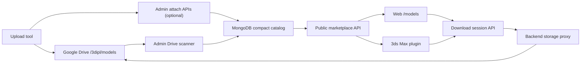

# Model Marketplace Development Handoff

Tai lieu nay danh cho AI/dev khac doc nhanh de tiep tuc phat trien he thong ban model 3D tren codebase hien tai.

Repo hien tai van giu he getlink/credit cu. Marketplace model la module moi nam song song, dung chung user/auth/payment/admin shell nhung co catalog, storage, quota va download session rieng.

## 1. Muc tieu san pham

He thong can ban/tai model 3D tu catalog rieng, gan voi goi Pro theo thang/ngay:

- Guest tai model Free: 3 luot/ngay.
- Free user tai model Free: 10 luot/ngay.
- Pro/Member tai model Free + Pro: mac dinh 100 luot/ngay.
- Tim bang hinh anh:
  - Free: 10 lan/ngay.
  - Pro: 150 lan/ngay.
- Web va plugin 3ds Max dung chung API download session, chung quota, chung log.
- File nang khong nam trong MongoDB.
- Google Drive la storage MVP cho archive, cover, preview va raw metadata.
- Backend proxy anh/file, frontend/plugin khong duoc nhin thay Drive link that.

Ngon ngu UI chinh la tieng Viet. Key he thong, enum, schema field giu tieng Anh.

## 2. Tai lieu lien quan

Doc theo thu tu nay:

1. `MODEL_MARKETPLACE_DEVELOPMENT.md`
   - File handoff nay, mo ta toan bo module de tiep tuc dev.
2. `MARKETPLACE_DATA_CONTRACT.md`
   - Contract chuan cho pipeline `upload tool -> cloud -> web -> plugin`.
   - Neu co mau thuan, contract nay la source of truth ve field/schema/rule.
3. `MARKETPLACE_DRIVE_NAMING.md`
   - Quy uoc dat folder/file tren Google Drive.
4. `SYSTEM_DOCUMENTATION.md`
   - Tai lieu lon cua he getlink cu, auth, payment, admin, cache.

## 3. Nguyen tac bat buoc

Khong duoc lam:

- Khong luu `description` cua model marketplace.
- Khong luu `tags`.
- Khong luu `source.raw`.
- Khong luu `source.url` hoac link nguon ngoai.
- Khong luu format/version/polygon/fileName goc vao Mongo.
- Khong dua Drive file ID/link that ra public API/frontend/plugin.
- Khong them filter tu do; filter phai nam trong `backend/src/data/marketplaceFilters.js`.
- Khong cho admin nhap category/filter tuy tien bang text tu do.
- Khong dung credit de mua le model marketplace trong phase hien tai. Model chi co Free hoac Pro.

Duoc lam:

- MongoDB luu catalog index nhe, status, quota, order, history.
- Google Drive luu file nang, anh preview, metadata raw `.json.gz`.
- Backend proxy cover/preview/file.
- Plugin tai file qua download session roi verify checksum.

## 4. Kien truc tong the



Hai noi luu tru cho model:

- MongoDB:
  - chi luu index nhe, user, quota, order, session, log.
- Google Drive:
  - archive model, cover, preview, metadata raw, checksum.

Telegram co the la nguon file ban dau cua chu du an, nhung pipeline chuan hien tai la upload tool dua file len Drive truoc, sau do web scan/attach.

## 5. Folder/file chuan tren Drive

Root mac dinh:

```text
/3dipl/
  /models/
    /{sourceModelId}-{slug}/
      model.zip | model.rar | model.7z
      model.sha256
      cover.jpg | cover.jpeg | cover.png
      preview-01.jpg | preview-01.jpeg | preview-01.png
      preview-02.jpg | preview-02.jpeg | preview-02.png
      metadata.json.gz
```

Vi du:

```text
/3dipl/models/6373049-outdoor-kitchen-145/
```

Rule quan trong:

- Cover bat buoc de grid dep, anh vuong, nen 392-512 px.
- Preview optional cho detail.
- Chi chap nhan anh `jpg`, `jpeg`, `png`.
- Archive chuan nen dat ten `model.zip`, `model.rar`, hoac `model.7z`.
- `model.sha256` nen co 64 hex chars cua archive.
- `metadata.json.gz` la JSON gzip chua field duoc phep.

Folder cu dang co dang `{sourceModelId}.{hash}` van scan duoc, nhung chuan moi nen doi sang `{sourceModelId}-{slug}`.

## 6. Metadata schema cho upload tool

Allowed fields only:

```json
{
  "sourceModelId": "6373049",
  "title": "Outdoor Kitchen 145",
  "sourceSlug": "outdoor-kitchen-145",
  "sourceCategoryId": "256",
  "accessType": "member",
  "renderer": "Corona",
  "styles": ["modern"],
  "renderers": ["corona"],
  "forms": ["rectangle"],
  "colors": ["black", "wood"],
  "materials": ["metal", "wood"],
  "sizeText": "25 MB",
  "sha256": "64_hex_characters"
}
```

Forbidden fields:

```json
{
  "description": "forbidden",
  "tags": ["forbidden"],
  "sourceUrl": "forbidden",
  "format": "forbidden",
  "version": "forbidden",
  "polygons": "forbidden",
  "fileName": "forbidden",
  "driveFileId": "forbidden"
}
```

Metadata complete khi co:

- Leaf category hop le.
- `accessType` optional, nhan `free`, `member`, hoac `pro`; backend normalize `pro` thanh `member`.
- `styles` co it nhat 1 gia tri hop le.
- `renderers` hoac `renderer` hop le.
- `forms` co it nhat 1 gia tri hop le.
- `colors` co it nhat 1 gia tri hop le.
- `materials` co it nhat 1 gia tri hop le.

Neu thieu metadata thi backend gan `metadataStatus=incomplete` va khong publish duoc.

## 7. Category va filter

Source of truth:

- Category tree: `backend/src/data/marketplaceCategories.js`
- Filter values: `backend/src/data/marketplaceFilters.js`

Filter hien tai:

- `style`: `classic`, `modern`, `ethnic`
- `render`: `vray`, `corona`, `standard`
- `form`: `round`, `oval`, `square`, `rectangle`, `triangle`, `diamond`, `pentagon`, `star`, `angle`, `bioform`
- `color`: `white`, `gray`, `black`, `brown`, `red`, `orange`, `yellow`, `beige`, `pink`, `magenta`, `purple`, `blue`, `sky`, `cyan`, `lime`, `green`
- `material`: `brick`, `ceramics`, `concrete`, `fabric`, `fur`, `glass`, `gypsum`, `leather`, `liquid`, `metal`, `organics`, `paper`, `plastic`, `rattan`, `stone`, `wood`

Khong co filter `format`.

Admin UI category phai chon theo cap:

```text
Danh muc me -> Danh muc con
```

Chi danh muc con/leaf moi duoc luu thanh category hoan chinh. Chon danh muc me co children thi model van incomplete.

## 8. Mongo models marketplace

### `MarketplaceCategory`

Dung de seed category tree tu `backend/src/data/marketplaceCategories.js`.

Luu:

- `sourceCategoryId`
- `title`
- `titleEn`
- `slug`
- `parentId`
- `position`
- `isActive`

Public API tra tree va flat list.

### `MarketplaceModel`

File: `backend/src/models/MarketplaceModel.js`

Chi luu compact catalog:

- `source.provider`, `source.modelId`, `source.slug`, `source.categoryId`, `source.syncedAt`
- `title`, `slug`
- `categoryId`, `parentCategoryId`, `categorySourceId`
- `coverImage`, `previewImages`
- `driveFolderId`, `driveFolderName`, `driveSignature`
- `lastDriveScanAt`, `lastDriveChangeAt`
- `styles`, `renderers`, `forms`, `colors`, `materials`
- `renderer`, `sizeText`
- `metadataStatus`, `metadataMissingFields`
- `accessType`
- `isPublished`
- `fileStatus`
- `storageProvider`, `storageKey`, `driveFileId`, `telegramFileRef`
- `archiveExt`, `fileSize`, `sha256`
- `metadataDriveFileId`, `metadataFileName`, `metadataSize`
- `downloadCount`

Enums quan trong:

```text
accessType: free | member
fileStatus: missing | pending_upload | ready | failed
metadataStatus: complete | incomplete
storageProvider: google_drive | b2 | r2 | local | telegram | ""
```

`member` la Pro trong UI.

### `DownloadSession`

File: `backend/src/models/DownloadSession.js`

Dung chung cho web va plugin.

Luu:

- `modelId`
- `userId` hoac `guestKey`
- `clientType`: `web | plugin`
- `tokenHash`
- `expiresAt`
- `status`: `active | used | expired | revoked`
- `quotaCharged`
- `accessTier`: `guest | free | member | admin`
- storage snapshot: `storageProvider`, `storageKey`, `driveFileId`
- download snapshot: `fileName`, `fileSize`, `sha256`

Public response khong tra `driveFileId`.

### `ModelDownload`

Log moi lan tao download session:

- model
- session
- user/guest
- client type web/plugin
- tier
- quota charged
- ip/userAgent

Dung cho admin log va user history.

### `DailyDownloadQuota`

File: `backend/src/models/DailyDownloadQuota.js`

Dung cho quota tai model:

- `dayKey`: theo Asia/Saigon.
- guest: nhan bang `guestKey`.
- user: nhan bang `userId`.
- `tier`: `guest | free | member`.
- `count`
- `bonusLimit`
- `resetAt`

Goi Daily Pro neu user dang Pro thi khong keo dai `proUntil`, ma cong `bonusLimit` cho ngay hien tai.

### `DailyImageSearchQuota`

Dung cho search bang hinh:

- Free: 10/ngay.
- Member: 150/ngay.
- Bat buoc user dang nhap.

## 9. Membership / Pro

Files:

- `backend/src/models/MembershipPlan.js`
- `backend/src/models/MembershipOrder.js`
- `backend/src/utils/membershipService.js`
- `backend/src/controllers/membershipController.js`
- `backend/src/routes/membershipRoutes.js`
- `frontend/src/pages/Membership.jsx`
- `frontend/src/pages/Topup.jsx`

Default plans:

- `DAILY`: 50k/ngay, end of Vietnam day.
- `SILVER`: 199k/thang, 30 ngay, end of Vietnam day.
- `GOLD`: 149k/thang x 3 thang, 90 ngay, end of Vietnam day.
- `DIAMOND`: 99k/thang x 12 thang, 365 ngay, end of Vietnam day.

Rule:

- Tat ca Pro expire tinh den 23:59:59.999 gio Viet Nam cua ngay het han.
- Neu mua DAILY khi dang Pro active:
  - khong ghi de `proUntil`.
  - tao quota addon trong `DailyDownloadQuota.bonusLimit`.
- Neu mua goi thang/quy/nam:
  - gia han tu `proUntil` hien tai neu con active.
  - neu het active thi tinh tu now.
- Payment Pro tach voi credit topup.
- Voucher co target rieng, membership voucher khong duoc cong credit.

## 10. Storage provider

File: `backend/src/utils/storageProvider.js`

Hien co:

- Google Drive stream/download/list folder.
- Local provider.
- Khung enum cho `b2`, `r2`, `telegram`.

Google Drive config:

```env
GOOGLE_DRIVE_CLIENT_ID=
GOOGLE_DRIVE_CLIENT_SECRET=
GOOGLE_DRIVE_REFRESH_TOKEN=
```

Co the dung access token tam:

```env
GOOGLE_DRIVE_ACCESS_TOKEN=
GOOGLE_DRIVE_BEARER_TOKEN=
```

Nhung production nen dung refresh token vi access token het han nhanh.

Backend APIs dung Drive:

- stream cover
- stream preview
- stream archive download
- scan folder
- read metadata json/gzip

## 11. Public marketplace APIs

File route: `backend/src/routes/marketplaceRoutes.js`

### List categories

```http
GET /api/marketplace/categories
```

Tra:

- `categories`: tree.
- `flat`: flat list.

### List filters

```http
GET /api/marketplace/filters
```

Tra fixed vocabularies.

### List/search models

```http
GET /api/marketplace/models
```

Query:

- `page`
- `limit`
- `q` hoac `search`
- `category`
- `accessType`: `free | pro | member`
- `fileStatus`
- `style`
- `render`
- `form`
- `color`
- `material`

Backend chi tra model:

- `isPublished=true`
- `metadataStatus=complete`

Khong tra:

- Drive file ID
- storage key
- raw metadata
- source URL
- tags/description/credit price

### Image search

```http
POST /api/marketplace/image-search
```

Dung quota rieng trong `DailyImageSearchQuota`.

Frontend mo popup cho phep chon file, keo tha hoac dan anh tu clipboard. Anh chi duoc gui khi user bam nut tim, vi vay viec chon/dan nham khong ton quota.

Backend khong tu gia lap ket qua bang danh sach model pho bien. Tim anh chi hoat dong khi da cau hinh similarity engine:

```env
MARKETPLACE_IMAGE_SEARCH_URL=https://image-search.example.com/search
MARKETPLACE_IMAGE_SEARCH_API_KEY=
MARKETPLACE_IMAGE_SEARCH_TIMEOUT_MS=20000
```

Backend gui JSON den provider:

```json
{
  "image": "data:image/jpeg;base64,...",
  "imageHash": "sha256...",
  "limit": 60
}
```

Provider phai tra ID trung voi `MarketplaceModel.source.modelId`:

```json
{
  "matches": [
    { "modelId": "6373049", "score": 0.93 }
  ]
}
```

Backend giu thu tu theo score cua provider, ap dung category/access/filter hien tai, sau do moi tao ket qua public. Quota chi bi tru sau khi provider tra thanh cong. Khi provider chua cau hinh, timeout, loi hoac tra JSON sai, request bi tu choi va quota khong doi.

De tim that tren catalog, dich vu ngoai can co vector index cua anh cover cho tung model. Mot huong trien khai phu hop la CLIP embedding + vector database; job dong bo phai upsert/xoa vector theo `source.modelId` khi model duoc publish, thay cover hoac bi go publish.

### Cover/preview proxy

```http
GET /api/marketplace/models/:id/cover
GET /api/marketplace/models/:id/preview/:index
```

Backend stream tu Drive. Frontend chi dung URL proxy.

### Model detail

```http
GET /api/marketplace/models/:slug
```

Tra model detail + recommended models.

Recommended hien match theo:

- category
- parent category
- access type
- renderer

Khong dung tags.

### Download session

```http
POST /api/marketplace/models/:id/download-session
POST /api/plugin/models/:id/download-session
GET  /api/download/session/:id/file?t=:token
```

Response session:

```json
{
  "session": {
    "_id": "session_id",
    "expiresAt": "2026-07-06T10:00:00.000Z",
    "fileName": "model-slug.zip",
    "fileSize": 26200794,
    "sha256": "64_hex_or_empty"
  },
  "downloadUrl": "/api/download/session/:id/file?t=:token",
  "remaining": 99,
  "resetAt": "2026-07-06T17:00:00.000Z"
}
```

Download session TTL hien la 15 phut.

## 12. Admin marketplace APIs

Route nam trong `backend/src/routes/adminRoutes.js`.

Tat ca can admin auth va audit log.

### List models

```http
GET /api/admin/marketplace/models
```

Filters:

- `page`
- `search`
- `fileStatus`
- `accessType`
- `published`
- `metadataStatus`

### Stats

```http
GET /api/admin/marketplace/stats
```

Dung cho KPI marketplace admin.

### Logs

```http
GET /api/admin/marketplace/downloads
GET /api/admin/marketplace/download-sessions
```

### Cleanup legacy raw/heavy fields

```http
POST /api/admin/marketplace/cleanup-raw
```

Xoa field cu:

- `source.raw`
- `source.url`
- `formats`
- `format`
- `version`
- `polygons`
- `fileName`
- `mainMaxFile`
- `description`
- `tags`
- `creditPrice`

### Drive batch scan

```http
POST /api/admin/marketplace/import-drive-folder
```

Body:

```json
{
  "rootFolderId": "drive_folder_id_or_url",
  "pageToken": "",
  "limit": 20,
  "accessType": "member",
  "isPublished": true
}
```

Scanner:

- doc folder con theo page token.
- tinh `driveSignature`.
- folder khong doi thi `unchanged`.
- folder doi thi doc file list, metadata, cover, preview, archive.
- upsert `MarketplaceModel`.

### Manual metadata import

```http
POST /api/admin/marketplace/models/import-metadata
```

Dung khi nhap nhanh model tu admin.

### Update model

```http
PUT /api/admin/marketplace/models/:id
```

Cho sua:

- title
- category
- filters
- renderer
- sizeText
- accessType
- publish
- fileStatus
- metadata refs

Khong cho sua tags/description/creditPrice.

### Attach archive

```http
POST /api/admin/marketplace/models/:id/attach-file
```

Gan:

- storageProvider
- storageKey
- driveFileId
- archiveExt
- fileSize
- sha256
- fileStatus

### Attach assets

```http
POST /api/admin/marketplace/models/:id/attach-assets
```

Gan:

- cover Drive file ID
- preview Drive file IDs
- metadata Drive file ID

## 13. Frontend files

### Marketplace public

File:

- `frontend/src/pages/Models.jsx`

Routes:

- `/models`
- `/models/:slug`

Chuc nang:

- Sidebar category.
- Search center.
- Filter Free/Pro.
- Filter style/render/form/color/material.
- Grid 5 cot x nhieu dong theo viewport.
- Card anh vuong, title, badge Pro nho.
- Hover hien size/render.
- Detail co cover/preview, metadata table, recommended models.

### Membership

Files:

- `frontend/src/pages/Membership.jsx`
- `frontend/src/pages/Topup.jsx`
- `frontend/src/pages/Home.jsx`
- `frontend/src/components/Navbar.jsx`

Rule UI:

- Topup co 2 mode ro rang: Credit va Pro.
- Voucher dung chung nhung target xu ly rieng backend.
- Header hien credit, theme/language, notification, account status.

### Admin marketplace

File:

- `frontend/src/components/AdminMarketplace.jsx`

Chuc nang:

- Tab import/scan Drive.
- Tab search/list models.
- Tab edit model.
- Tab logs.
- Category picker cha -> con.
- Filter picker fixed values.
- Access only Free/Pro.
- Attach file/cover/preview/metadata.

## 14. Upload tool design

Upload tool nen lam theo pipeline:

1. Nhan source folder/file tu Telegram/local.
2. Lay/tao metadata tu model source ID.
3. Normalize title/slug.
4. Map category ve `sourceCategoryId` leaf.
5. Map filter ve controlled values.
6. Tao cover vuong.
7. Tao preview images.
8. Tinh `sha256` archive.
9. Tao `metadata.json`.
10. Gzip thanh `metadata.json.gz`.
11. Upload len Drive theo folder chuan.
12. Goi admin attach API hoac cho scanner batch quet.

Pseudo payload metadata:

```json
{
  "sourceModelId": "6373049",
  "title": "Outdoor Kitchen 145",
  "sourceSlug": "outdoor-kitchen-145",
  "sourceCategoryId": "256",
  "accessType": "member",
  "renderer": "Corona",
  "styles": ["modern"],
  "renderers": ["corona"],
  "forms": ["rectangle"],
  "colors": ["black"],
  "materials": ["metal", "wood"],
  "sizeText": "25 MB",
  "sha256": "..."
}
```

Tool phai validate truoc khi upload:

- folder name dung chuan.
- archive ton tai.
- cover ton tai va vuong.
- metadata khong co forbidden fields.
- category la leaf.
- filters hop le.
- checksum khop file.

## 15. Plugin 3ds Max design

Plugin sau nay khong nen biet Drive.

Flow:

1. User login/token voi web backend.
2. Plugin search/list model qua public API.
3. Plugin goi:

```http
POST /api/plugin/models/:id/download-session
```

4. Backend charge quota va tra `downloadUrl`, `fileName`, `fileSize`, `sha256`.
5. Plugin tai archive ve cache.
6. Verify sha256 neu co.
7. Extract archive.
8. Tim file `.max`.
9. Goi 3ds Max `mergeMAXFile` de merge vao scene.

Cache local nen luu theo:

```text
%LOCALAPPDATA%/3dipl-plugin/cache/{modelId}/{sha256}/
```

Neu sha256 khong doi thi co the reuse cache.

## 16. Quota va access

Download access:

```text
Model free:
  guest/free/member/admin tai duoc theo quota

Model member:
  chi member/admin tai duoc
```

Quota:

```text
guest: 3/day
free: 10/day
member: user.proDailyDownloadLimit, default 100/day
admin: unlimited
```

Day key/reset:

- Dung Asia/Saigon.
- Reset luc 00:00 gio Viet Nam.
- `nextVietnamReset()` tra UTC tuong ung 17:00 ngay truoc/tiep theo.

Image search:

```text
free: 10/day
member: 150/day
```

Quota chi duoc charge cho request ma similarity provider xu ly thanh cong. Engine chua cau hinh hoac provider loi khong duoc tru luot.

## 17. Payment and vouchers

Pro order:

- `MembershipOrder`
- payment code prefix dang `PRO...`
- SePay checkout rieng.
- Duyet order bang `approvePendingMembershipOrder`.
- Khong cong credit.

Credit topup:

- Flow cu cua he getlink.
- Khong kich hoat Pro.

Voucher:

- Voucher phai co target dung.
- Membership voucher giam tien Pro.
- Credit voucher dung cho credit/topup.
- Khong tron 2 loai.

## 18. Current known gaps / next work

Can lam tiep:

- Upload tool rieng de upload tu Telegram/local len Drive theo contract.
- Search bang hinh thuc su bang embedding/perceptual hash. Hien quota/API khung da co.
- Plugin 3ds Max.
- Admin UX nang cao cho batch scan 200k model:
  - resume token
  - progress job background
  - failed folder report
  - requeue folder loi
- CDN/cache layer neu preview traffic tang.
- R2/B2 provider neu Drive bi gioi han/quota.
- Automated validation script cho `metadata.json.gz`.
- Test integration cho download session plugin.

Khong nen lam:

- Khong them raw metadata vao Mongo de "cho nhanh".
- Khong them tags/free text filter.
- Khong expose Drive file ID ra frontend/plugin.
- Khong cho plugin download Drive link truc tiep.
- Khong scan 200k folder trong mot request duy nhat.

## 19. Test checklist

Backend:

```powershell
node --check backend/src/models/MarketplaceModel.js
node --check backend/src/models/DownloadSession.js
node --check backend/src/controllers/marketplaceController.js
node --check backend/src/controllers/marketplaceAdminController.js
node --check backend/src/utils/marketplaceDownloadService.js
```

Frontend:

```powershell
npm run build --prefix frontend
```

Manual API checks:

```powershell
Invoke-RestMethod http://localhost:5000/api/marketplace/categories
Invoke-RestMethod http://localhost:5000/api/marketplace/filters
Invoke-RestMethod http://localhost:5000/api/marketplace/models
```

Expected:

- filters khong co `format`.
- models khong co `tags`, `description`, `creditPrice`.
- preview/cover URL la backend proxy.
- public API khong co Drive file ID.

Admin manual checks:

- Import Drive folder tao model moi.
- Folder khong doi thi `unchanged`.
- Sua category me co child thi model incomplete.
- Chon category con + all filters thi metadata complete.
- Attach archive xong `fileStatus=ready`.
- Publish chi thanh cong khi metadata complete.

Download checks:

- Guest tai model free toi da 3 lan/ngay.
- Free user tai model free toi da 10 lan/ngay.
- Free user khong tai duoc model member.
- Pro tai duoc model member.
- Session expired thi khong tai duoc.
- Download response khong lo Drive file ID.
- Plugin endpoint tao session co `sha256`.

## 20. Important files map

Backend:

```text
backend/src/data/marketplaceCategories.js
backend/src/data/marketplaceFilters.js
backend/src/models/MarketplaceCategory.js
backend/src/models/MarketplaceModel.js
backend/src/models/DownloadSession.js
backend/src/models/ModelDownload.js
backend/src/models/DailyDownloadQuota.js
backend/src/models/DailyImageSearchQuota.js
backend/src/models/MembershipPlan.js
backend/src/models/MembershipOrder.js
backend/src/controllers/marketplaceController.js
backend/src/controllers/marketplaceAdminController.js
backend/src/controllers/membershipController.js
backend/src/routes/marketplaceRoutes.js
backend/src/routes/membershipRoutes.js
backend/src/utils/marketplaceDownloadService.js
backend/src/utils/membershipService.js
backend/src/utils/storageProvider.js
backend/src/utils/marketplaceSeed.js
```

Frontend:

```text
frontend/src/pages/Models.jsx
frontend/src/pages/Membership.jsx
frontend/src/pages/Topup.jsx
frontend/src/pages/Home.jsx
frontend/src/components/AdminMarketplace.jsx
frontend/src/components/Navbar.jsx
frontend/src/styles.css
```

Docs:

```text
MODEL_MARKETPLACE_DEVELOPMENT.md
MARKETPLACE_DATA_CONTRACT.md
MARKETPLACE_DRIVE_NAMING.md
SYSTEM_DOCUMENTATION.md
```

## 21. Recommended prompt for another AI

Neu giao cho AI khac, paste doan nay:

```text
Read MODEL_MARKETPLACE_DEVELOPMENT.md first, then MARKETPLACE_DATA_CONTRACT.md.
Do not add tags, description, source.raw, source.url, format/version/polygon, or model credit price to marketplace models.
Keep Mongo compact and keep heavy files on Drive.
All user/plugin downloads must go through backend download sessions.
Before coding, inspect the files listed in section 20 and follow existing patterns.
After coding, run backend node --check and npm run build --prefix frontend.
```
