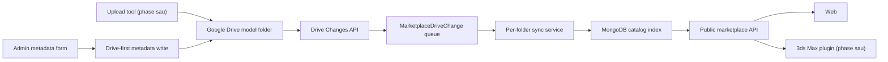

# Model marketplace development guide

Tai lieu nay mo ta hien trang implementation. Data rules chi tiet nam tai
`MARKETPLACE_DATA_CONTRACT.md`; naming nhanh nam tai `MARKETPLACE_DRIVE_NAMING.md`.

## Implemented architecture



Drive la canonical source cho metadata/archive/cover/preview. Mongo luu index nhe
va state van hanh. Khong co automatic root scanner.

## Backend modules

### Metadata core

`backend/src/utils/marketplaceMetadata.js`

- Normalize schema V2.
- Validate controlled vocabulary.
- Stable serialization.
- SHA-256 metadata hash.
- Field-level diff cho optimistic conflict.

### Drive provider

`backend/src/utils/storageProvider.js`

- Refresh OAuth access token.
- Read/list/stream Drive file.
- `files.update` metadata content.
- Multipart create metadata/backup file.
- `changes.getStartPageToken` va `changes.list`.
- Shared Drive support qua `supportsAllDrives`.

### Folder sync service

`backend/src/utils/marketplaceDriveService.js`

- `syncMarketplaceDriveFolder` chi doc mot folder.
- `writeMarketplaceModelMetadata` Drive-first, verify read-back, sau do sync Mongo.
- `inspectMarketplaceModelMetadata` cho migration dry-run.
- `markMarketplaceDriveModelMissing` khoa model khi folder mat.

### Changes worker

`backend/src/utils/marketplaceDriveSyncJob.js`

- Poll 120 giay mac dinh.
- Queue deduplicate theo folder.
- Retry exponential toi da 8 lan.
- Luu token va checkpoint trong Mongo.
- Process-level va Mongo state lock.

### Models

- `MarketplaceModel`: catalog + state.
- `MarketplaceDriveChange`: queue folder change.
- `MarketplaceDriveSyncState`: Changes token, reconcile/migration checkpoint.
- `MarketplaceCategory`: controlled category tree.
- `DownloadSession`, `ModelDownload`, `DailyDownloadQuota`: download operation.

## Admin API

Metadata Drive:

```text
PUT /api/admin/marketplace/models/:id/metadata
```

Public state Mongo:

```text
PATCH /api/admin/marketplace/models/:id/state
```

Sync/repair:

```text
POST /api/admin/marketplace/drive/sync-folder
POST /api/admin/marketplace/drive/reconcile
POST /api/admin/marketplace/drive/migrate-metadata
POST /api/admin/marketplace/sync-run
GET  /api/admin/marketplace/sync-state
```

Bulk action:

- Publish/unpublish chi sua `desiredPublished` va computed online state.
- Free/Pro bulk action ghi metadata Drive tung model.
- Rescan bulk chi sync cac folder duoc chon; gioi han 10.

Compatibility `attach-file`/`attach-assets` van co cho migration. UI an cac form ID;
backend verify Drive parent va sync folder neu model da co folder.

## Admin UI

`frontend/src/components/AdminMarketplace.jsx`

Admin cu duoc giu, khong thay shell tong the. Marketplace co bon tab:

- Import / dong bo.
- Tim kiem model.
- Chinh sua model.
- Nhat ky tai.

Edit model tach hai section:

1. Metadata tren Drive: title, category, Free/Pro va facets.
2. Trang thai van hanh: public slug, desired publish, actual online blockers.

Metadata save:

- Disable button trong khi ghi.
- Hien revision sau khi Drive verify.
- 409 mo modal diff.
- Nut nap ban Drive chi nap vao form; admin review va bam save lai.

Import / sync:

- Sync mot model bang folder ID/URL.
- Changes API manual poll.
- Full reconciliation co page-token checkpoint.
- Migration V2 dry-run va backup/write batch.

## Public behavior

Catalog list/detail chi query:

```text
isPublished=true
metadataStatus=complete
fileStatus=ready
```

Preview URL:

```text
/api/marketplace/models/:id/cover?v=...
/api/marketplace/models/:id/preview/:index?v=...
```

Backend stream Drive; response catalog khong co Drive ID/link. URL version thay doi
khi model sync de browser khong giu cover cu.

Download web/plugin dung chung download session va quota. Plugin contract khong doi.

## Publication examples

| desired | metadata | archive | cover | actual online |
| --- | --- | --- | --- | --- |
| false | valid | ready | ready | false |
| true | invalid | ready | ready | false |
| true | valid | missing | ready | false |
| true | valid | ready | missing | false |
| true | valid | ready | ready | true |

Preview phu khong tham gia bang nay.

## Migration runbook

1. Backup MongoDB.
2. Tam khoa upload/admin metadata edit.
3. Dam bao ca hai feature flag false.
4. Chay dry-run batch, review invalid category/facets.
5. Tao refresh token scope full Drive va bat write flag.
6. Chay migration batch; moi batch tao backup Drive cu.
7. Sua model loi va retry cung checkpoint.
8. Chay reconciliation cho den `hasMore=false`.
9. Restart backend voi Changes flag true de lay start token sau migration.
10. Mo lai edit/upload.

Khong bat Changes truoc khi migration ket thuc, neu khong worker co the ingest metadata
cu trong luc Mongo-wins migration dang chay.

## Verification

Focused regression suite:

```powershell
node --test backend/test/marketplace-drive-sync.test.js
```

Full project:

```powershell
npm run check
```

Tests cover vocabulary, per-folder update, preview deletion, archive blocker/restore,
Drive failure, conflict, successful revision, queue dedup va public serialization.

## Explicitly out of scope

- Upload tool UI/worker.
- 3ds Max plugin implementation.
- Drive push webhook channel; V2 dung polling.
- CDN/R2 migration.

Backend contract `sync-folder` va public download-session da san sang cho upload tool
va plugin duoc lam o phase sau.
