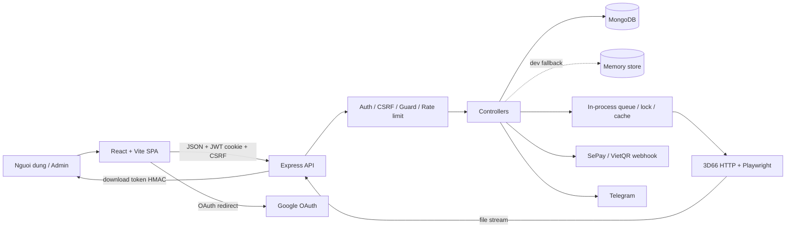

# Audit he thong Get Link 3D66

Ngay audit: 2026-07-10  
Baseline: commit `52a2ab4` (`main`)  
Nhanh lam viec: `upgrade/new-model-system-review`

> Pham vi: toan bo file tracked trong backend, frontend, manifest/lockfile, tai lieu he thong, public assets va cau hinh mau. File `backend/.env` khong duoc doc/in gia tri va khong duoc tracked. `SYSTEM_DOCUMENTATION.md` da co thay doi cua nguoi dung truoc audit (145 dong them, 20 dong xoa); audit giu nguyen thay doi nay.

## 1. Tom tat dieu hanh

He thong la mot ung dung full-stack JavaScript gom React/Vite o frontend va Express/Mongoose o backend. MongoDB la kho du lieu production; memory store chi la fallback development. Backend ket noi Google OAuth, SePay/VietQR, 3D66, Telegram va proxy stream file truc tiep, khong luu file tai local.

Baseline co the build va khoi dong trong memory mode, nhung chua co test suite, lint, typecheck, CI/CD, Docker, migration framework, backup/restore automation hay readiness check. Audit xac nhan cac van de uu tien cao sau:

- P0: credit bi tru truoc khi tao lich su getlink, khong co transaction/compensation neu ghi lich su loi.
- P0: `gatewayTransactionId` khong unique; hai webhook dong thoi co the dung cung mot giao dich de duyet hai topup khac nhau.
- P1: API history tra `resolvedSourceUrl`, co the chua URL sign cua tai khoan 3D66 he thong.
- P1: proxy anh preview cho phep fetch HTTP(S) ngoai 3D66 va follow redirect, tao be mat SSRF.
- P1: Google OAuth khong tao/kiem tra `state`, nen chua chong login CSRF/session swapping.
- P1: topup het han/bi huy chuyen sang `rejected`, trong khi webhook chi duyet `pending`; tien den muon khong duoc cong credit.
- P1: API admin tra document User day du, bao gom `twoFactorSecret`; cookie pool con tra preview mot phan credential.
- P1: TOTP secret luu plaintext trong MongoDB.
- P1: dependency audit co advisory critical/high trong tooling va runtime.

Khong phat hien high-confidence secret pattern trong cac file text dang duoc Git track. Ket luan nay khong thay the secret scanner trong CI va khong danh gia gia tri trong `.env` bi ignore.

## 2. Kien truc hien tai

### 2.1 Thanh phan

| Nhom | Hien trang xac nhan tu code |
|---|---|
| Frontend | React 18.3.1, Vite 6.4.2 (lockfile), routing thu cong trong `frontend/src/App.jsx`, API wrapper tai `frontend/src/api.js` |
| Backend | Node.js ESM, Express 4.22.2 (lockfile), entry `backend/server.js` |
| Database | MongoDB/Mongoose 8.23.1; memory adapter development neu `ALLOW_MEMORY_DB=true` va khong phai production |
| Authentication | Google OAuth qua Passport; access/refresh JWT trong httpOnly cookie; admin 2FA TOTP |
| Authorization | `requireAuth`, `requireNotBanned`, `adminOnly` (role + `ADMIN_EMAILS` + 2FA neu da enable) |
| API | REST JSON tai `/api`; download/preview image la stream/binary |
| Worker/cron/queue | Khong co process worker/cron rieng. Queue 3D66, browser queue, lock, rate limit va expiry topup deu chay inline trong process web |
| File storage | Khong co object/local file storage. File 3D66 duoc proxy stream; URL upstream luu trong MongoDB |
| Cache | `ProductCache` trong MongoDB; footprint/proxy agent/rate-limit/lock/counter trong RAM |
| Dich vu ngoai | Google, MongoDB, 3D66, SePay, VietQR legacy/du phong, Telegram, YouTube embed |
| Thanh toan | SePay la luong mac dinh; VietQR webhook van ton tai |
| Deploy | Chi co `npm start` cho backend va `vite build` cho frontend. Khong co Docker/Compose, PM2/systemd, reverse-proxy config, CI/CD hay IaC trong repo |

### 2.2 So do Mermaid

### 2.3 Entry point va cach chay

- Root orchestration: `package.json` (`install:all`, `dev`, `start`).
- Backend: `backend/server.js`, mac dinh port 5000.
- Frontend: `frontend/index.html` nap truc tiep `frontend/src/App.jsx`, Vite mac dinh port 5173.
- Local: `npm run install:all`, `npm run dev`.
- Production hien tai: `npm start` chi start backend; frontend can build va phuc vu boi thanh phan ngoai repo.
- Runtime audit: Node `v20.20.1`, npm `10.8.2`. Manifest chua khai bao `engines` hoac `packageManager`.

## 3. Doi chieu tai lieu voi source

| Chuc nang | Yeu cau trong `SYSTEM_DOCUMENTATION.md` | Vi tri code | Trang thai | Van de phat hien | Uu tien | De xuat |
|---|---|---|---|---|---|---|
| Google OAuth | Dang nhap Google, callback tao JWT | `server.js`, `authController.js`, `authRoutes.js` | Mot phan/co loi | Khong co OAuth `state`; `returnTo` chi thuc su giu `/admin` hoac `/` | P1 | Them nonce state cookie, timing-safe verify, test callback sai/thieu state |
| JWT session | Access 15 phut, refresh 7 ngay, fingerprint | `jwtAuth.js` | Da trien khai | Khong revoke refresh token khi logout; legacy token khong co `tokenType` van duoc chap nhan; fingerprint mac dinh chi log | P2 | Ke hoach session version/jti va bo legacy compatibility sau rollout |
| Admin/2FA | Role + allowlist + TOTP | `adminOnly.js`, `authController.js`, `User.js` | Da trien khai nhung co rui ro | TOTP secret plaintext; admin API co the serialize secret | P1 | Encrypt secret at rest va loai khoi moi response |
| Preview getlink | Validate model, doc metadata/gia, cache | `getlinkController.js`, `3d66Service.js` | Da trien khai | Phu thuoc cookie/3D66; cache/queue RAM khong distributed | P2 | Shared coordination neu scale nhieu instance |
| Tao getlink | Lay file, tru credit atomic, tao history | `getlinkController.js:1241+`, `creditService.js` | Co loi | Tru credit va tao `Getlink` khong cung transaction/compensation | P0 | Unit of work transaction; compensation fallback co log |
| Tai lai mien phi | Cua so ngay/so luot, refresh URL | `prepareRedownload`, `downloadGetlink` | Da trien khai | Route `POST /getlink/redownload/:id` khong co trong bang route tai lieu | P3 | Cap nhat tai lieu |
| Download proxy | Owner/HMAC token, range, limit, stream | `downloadGetlink`, `request3D66File` | Da trien khai mot phan | Redirect response chua duoc validate lai; graceful shutdown thieu | P1/P2 | Validate redirect/final URL; drain HTTP khi shutdown |
| Download anh preview | Token va gioi han 15 MB | `downloadGetlinkPreviewImage` | Co loi | SSRF qua URL/redirect ngoai 3D66; buffer RAM; chua dung global slot | P1 | Allowlist tung redirect, timeout va concurrency slot |
| History user | Khong expose file URL | `getlinkHistory`, `publicHistoryItem` | Co loi | `fileUrl` bi omit khi JSON, nhung `resolvedSourceUrl` van bi expose | P1 | Dung serializer allowlist |
| Goi nap | Lay package, tao checkout SePay | `topupController.js`, `sepay.js` | Da trien khai | Khong idempotency; frontend co the double submit; GET package co the tu dong ghi/ghi de package default | P1/P2 | Idempotency key/loading guard; tach sync default khoi public GET |
| Webhook/IPN | Verify secret, amount, duplicate, transaction | `paymentController.js`, `topupApprovalService.js` | Co loi | Khong duyet topup `rejected`; duplicate transaction race; Mongo standalone khong ho tro transaction | P0/P1 | Unique index + query eligible status + tai lieu replica set |
| Voucher | Apply safe payload, claim khi approve | `voucherController.js`, `topupApprovalService.js` | Gan day du | Memory mode khong enforce `$expr`/unique nhu Mongo; query thieu compound index | P2 | Sua adapter/test Mongo; them index qua migration |
| Referral | Thuong hai ben/referrer-only | `referralService.js` | Mot phan/co rui ro | Nhieu write + rollback thu cong, khong transaction; crash co the de du lieu do dang | P1 | Transaction Mongo va idempotent repair path |
| Notification | Target, fullscreen/dropdown, mark read | `notificationController.js`, `Notification.js` | Da trien khai | `readBy` tang vo han trong mot document broadcast | P2 | Tach receipt collection co unique `(notification,user)` |
| Settings | Public homepage + admin runtime config | `settingsController.js`, `settingsRoutes.js` | Khac tai lieu ve exposure | Public response gom ca concurrency/timeout/proxy flags, `_id`, timestamps; update settings chua audit/rate limit | P2 | Serializer public/admin rieng; audit + rate limit write |
| Admin | Users, credit, packages, vouchers, logs | `adminController.js`, `Admin.jsx` | Da trien khai nhung co loi | User secret/cookie preview; overview load toan bo collection; manual credit khong transaction voi ledger | P1/P2 | Serializer safe, aggregation, transaction ledger |
| Guide | CRUD + renderer text an toan | `guideController.js`, `GuideContent.jsx` | Da trien khai | Slug unique toan cuc nen ban dich cung slug khong the ton tai | P3 | Xac nhan nghiep vu; neu can, unique `(slug,language)` |
| Database | Schema/index/transaction | `models/*`, startup `ensureTopupIndexes` | Mot phan | Khong migration framework/rollback; startup tu drop index cu; thieu unique transaction id/index query | P0/P1 | Migration versioned, preflight duplicate scan, rollback plan |
| Memory DB | Local/dev fallback | `memoryStore.js` | Mot phan/co loi | Thieu `$unset`, `deleteOne`, `skip`, regex/Date semantics, unique constraints, query chaining | P2 | Nang adapter hoac dung Mongo test container |
| Cookie pool | Encrypt AES-GCM, cooldown/failover | `secretBox.js`, `3d66CookiePool.js` | Da trien khai | Cookie preview lo mot phan credential; key rotation khong co version/re-encrypt plan | P1/P2 | Khong tra preview; ke hoach rotation |
| Rate limit/queue | Chong abuse va concurrency | `rateLimit.js`, `asyncLimiter.js`, queues | Da trien khai mot instance | RAM-only; cleanup bucket O(n) moi request; khong scale ngang | P2 | Redis/shared limiter; cleanup dinh ky |
| Health/monitor | Health, log, Telegram | `server.js`, `logger.js`, `systemLog.js` | Mot phan | `/health` chi `{ok:true}`, khong readiness DB; log retention/metrics/error tracking thieu | P2 | `/live` + `/ready`, metrics, retention, alerting |
| Deploy/backup | Production safety | Khong co artifact tuong ung | Chua trien khai trong repo | Khong Docker/CI/staging/backup/restore/rollback/zero-downtime config | P1/P2 | Checklist + automation theo ha tang thuc te, khong tu deploy |

## 4. Lenh da chay va ket qua baseline

| Lenh/kiem tra | Ket qua |
|---|---|
| `git status --short --branch`, `git log -1 --oneline` | Baseline `main`, commit `52a2ab4`; chi `SYSTEM_DOCUMENTATION.md` da sua truoc audit |
| Tao nhanh `upgrade/new-model-system-review` | Thanh cong, truoc moi file edit |
| `npm ci --ignore-scripts` (root/backend/frontend) | Thanh cong; khong chay lifecycle scripts |
| `node --check` cho `backend/server.js` + `backend/src/**/*.js` | Pass 72/72 file |
| `npm run build` trong frontend | Pass; JS 364.33 kB (gzip 103.22 kB), CSS 101.94 kB (gzip 19.22 kB) |
| Lint | Khong co script/config lint trong repo; chua the chay baseline lint that |
| Typecheck | Project JavaScript khong co TypeScript/JSDoc typecheck script |
| Unit/integration test | Khong co test script hay test file tracked |
| Smoke server voi Mongo local khong kha dung + memory fallback | `/health` 200, settings OK, 4 package default, history khong auth 401, CORS origin la 403 |
| Reproduction memory controller | Xac nhan payload history co key `resolvedSourceUrl`; SePay cho topup `rejected` tra `topup_not_found_or_already_handled` |
| Secret pattern scan tren tracked text | Khong co high-confidence finding; khong doc/in `.env` that |
| `npm audit` root | 2 critical do `shell-quote@1.8.3` qua `concurrently`; `--omit=dev` = 0 |
| `npm audit` backend | 1 high `form-data@4.0.5` qua SePay SDK/Axios; 1 moderate `qs@6.15.1` qua Express |
| `npm audit` frontend | 1 high Vite 6.4.2; 1 low Babel core 7.29.0 (build/dev toolchain) |
| `npm outdated` | Patch/minor an toan co san; major Express/Mongoose/React/Vite de batch rieng, khong tu dong nang |

## 5. Findings chi tiet

### AUD-P0-01 - Tru credit va tao history khong atomic

- Mo ta: `deductCredit()` hoan tat truoc `Getlink.create()`.
- Bang chung: `getlinkController.js` thuc hien atomic `$inc` am, sau do tao history ma khong transaction va khong compensation.
- File: `backend/src/controllers/getlinkController.js`, `backend/src/utils/creditService.js`.
- Nguyen nhan goc: unit of work bi tach thanh hai write.
- Tac dong: DB/network/process loi sau khi tru credit lam user mat credit nhung khong co download/history.
- Tai hien: mock `Getlink.create` throw sau khi `deductCredit` thanh cong; credit giam.
- Phuong an sua: transaction Mongo cho deduct + history; fallback dev phai compensation idempotent va log canh bao.
- Rui ro regression: transaction yeu cau Mongo replica set; can xu ly deployment standalone ro rang.
- Kiem thu: test history create failure, concurrent insufficient credit, success path.
- Rollback: revert service transaction/compensation; khong rollback data bang cach xoa. Doi soat credit bang audit log neu rollout loi.

### AUD-P0-02 - Duplicate gateway transaction race

- Mo ta: duplicate check la read truoc write, `gatewayTransactionId` chi co index thuong.
- Bang chung: ca VietQR va SePay `findOne` duplicate, sau do moi transaction cap nhat topup; schema khong unique.
- File: `paymentController.js`, `Topup.js`, `topupApprovalService.js`.
- Nguyen nhan goc: khong co DB invariant cho id giao dich gateway.
- Tac dong: cung mot giao dich co the cong credit cho hai topup neu webhook dong thoi/ma bi reuse.
- Tai hien: hai topup pending, chay approve dong thoi voi cung transaction id tren Mongo replica set.
- Phuong an sua: preflight duplicate scan, unique partial index cho non-empty `gatewayTransactionId`, bat E11000 thanh duplicate idempotent.
- Rui ro regression: index build fail neu production da co duplicate; khong duoc tao index mu truoc preflight.
- Kiem thu: concurrency integration test tren Mongo replica set.
- Rollback: drop index moi neu can, giu code duplicate check; khong sua/xoa transaction cu tu dong.

### AUD-P1-01 - Ro `resolvedSourceUrl` cho user

- Mo ta: serializer history spread toan bo document va chi gan `fileUrl: undefined`.
- Bang chung: reproduction xac nhan object response co `resolvedSourceUrl`; truong nay co the chua `sign` tai khoan 3D66.
- File: `backend/src/controllers/getlinkController.js` (`publicHistoryItem`).
- Nguyen nhan goc: denylist serialization thay vi allowlist.
- Tac dong: lo URL noi bo/credential-like signature va implementation detail.
- Tai hien: tao history co `resolvedSourceUrl`, goi `GET /api/getlink/history`.
- Phuong an sua: response allowlist; khong tra `fileUrl`, `sourceUrl`, `resolvedSourceUrl`.
- Rui ro regression: frontend nao dang phu thuoc field khong documented se mat field; source hien tai khong dung cac field noi bo.
- Kiem thu: response contract test assert field khong ton tai.
- Rollback: revert serializer; khong can data rollback.

### AUD-P1-02 - SSRF qua preview image

- Mo ta: backend nhan `history.imageUrl`, chap nhan moi HTTP(S), `fetch` follow redirect.
- Bang chung: `resolvePreviewImageUrl` khong allowlist host; vong fetch khong validate tung redirect/final URL.
- File: `backend/src/controllers/getlinkController.js`.
- Nguyen nhan goc: validation protocol thay vi trust boundary theo hostname/redirect.
- Tac dong: request den metadata/internal service, RAM DoS qua nhieu anh 15 MB.
- Tai hien: history co image URL ngoai 3D66 hoac redirect sang host ngoai.
- Phuong an sua: chi HTTPS host 3D66/subdomain, redirect manual toi da, validate moi hop, dung download slot.
- Rui ro regression: CDN hop le ngoai 3D66 co the bi chan; can allowlist explicit khi co bang chung.
- Kiem thu: external host, credential URL, redirect external, redirect loop, valid 3D66.
- Rollback: revert allowlist; khong co data rollback.

### AUD-P1-03 - Google OAuth thieu `state`

- Mo ta: login/callback khong sinh va verify OAuth state.
- Bang chung: `passport.authenticate("google")` chi co scope/session.
- File: `authController.js`, `authRoutes.js`.
- Nguyen nhan goc: Passport chay stateless JWT nhung khong co custom state store.
- Tac dong: login CSRF/session swapping, user co the bi dang nhap vao tai khoan do attacker khoi tao.
- Tai hien: callback OAuth khong co/sai state van vao Passport flow neu code Google hop le.
- Phuong an sua: CSPRNG nonce trong httpOnly SameSite cookie, gui `state`, timing-safe verify va clear cookie.
- Rui ro regression: callback dang dang do rollout co the that bai; can deploy mot lan va cho phep login lai.
- Kiem thu: state dung/sai/thieu/het cookie.
- Rollback: revert middleware state; khong co data migration.

### AUD-P1-04 - Thanh toan den muon khong duoc credit

- Mo ta: expiry/cancel dat `status=rejected`, webhook chi tim `status=pending`.
- Bang chung: reproduction tra `topup_not_found_or_already_handled` cho IPN hop le cua topup rejected.
- File: `topupExpiryService.js`, `topupController.js`, `paymentController.js`, `topupApprovalService.js`.
- Nguyen nhan goc: trang thai UI het han bi coi la terminal accounting state.
- Tac dong: khach da chuyen tien nhung khong duoc credit; doi soat thu cong.
- Tai hien: de topup het 30 phut hoac callback cancel, sau do gui IPN signed/amount dung.
- Phuong an sua: IPN signed duoc phep transition `pending` hoac `rejected` sang approved, van enforce package/voucher/idempotency.
- Rui ro regression: topup bi cancel nhung sau do thuc su tra tien se duoc credit (day la hanh vi mong muon); can UI message chinh xac.
- Kiem thu: pending, expired, user_cancel, duplicate va insufficient amount.
- Rollback: revert eligible state query; khong downgrade topup da approved.

### AUD-P1-05 - Secret 2FA/cookie bi serialize

- Mo ta: `listUsers` va mot so admin mutation tra full User; cookie summary tra dau/cuoi credential.
- Bang chung: `User.find()` khong select, response `res.json({ users })`; `summarizeCookie.preview` cat chuoi decrypted.
- File: `adminController.js`, `User.js`.
- Nguyen nhan goc: response dung raw model.
- Tac dong: tang blast radius khi admin browser/log/XSS bi compromise.
- Tai hien: goi admin users/cookies voi tai khoan co 2FA/cookie.
- Phuong an sua: safe serializer/select; preview chi bao `configured`, khong ky tu credential.
- Rui ro regression: UI cookie preview thay doi hien thi; khong doi chuc nang test/delete.
- Kiem thu: assert response khong co `twoFactorSecret`, `value`, credential fragment.
- Rollback: revert serializer; khong co data rollback.

### AUD-P1-06 - TOTP secret plaintext at rest

- Mo ta: `twoFactorSecret` luu Base32 plaintext.
- Bang chung: `verifyAndEnable2FA` ghi thang `tempSecret` vao User.
- File: `authController.js`, `User.js`, `secretBox.js`.
- Nguyen nhan goc: encryption utility chi duoc dung cho cookie/proxy.
- Tac dong: DB leak cho phep tao OTP admin.
- Tai hien: doc document User (khong in gia tri trong audit).
- Phuong an sua: encryption prefix versioned, dual-read plaintext/encrypted, re-encrypt khi verify/login; ke hoach key rotation.
- Rui ro regression: sai key lam admin khong verify duoc; can backup va break-glass.
- Kiem thu: enroll encrypted, verify legacy plaintext, wrong key fail closed.
- Rollback: code dual-read phai duoc giu den khi xac nhan; khong bulk rewrite/rollback tu dong.

### AUD-P1-07 - Referral va manual credit co multi-write khong atomic

- Mo ta: referral tao record, cap nhat hai user, notification va rollback thu cong; admin add credit cap nhat user truoc tao Topup ledger.
- Bang chung: `referralService.js`, `adminAddCredit`.
- Nguyen nhan goc: khong dung transaction/unit of work.
- Tac dong: credit/ledger/referral khong nhat quan neu crash hay write loi.
- Tai hien: inject failure sau tung write.
- Phuong an sua: Mongo transaction; notification outbox/best-effort sau commit.
- Rui ro regression: Mongo standalone.
- Kiem thu: fault injection va concurrency.
- Rollback: revert transaction wrapper; doi soat bang script read-only truoc khi sua data.

### AUD-P1-08 - Dependency co advisory high/critical

- Mo ta: lockfile hien tai bi `npm audit` canh bao.
- Bang chung: `shell-quote`, `form-data`, `qs`, Vite, Babel nhu bang lenh.
- File: ba `package.json` va `package-lock.json`.
- Nguyen nhan goc: range/lock cu va dependency `file:..` khong can thiet o backend/frontend.
- Tac dong: tooling command injection/path issue; runtime CRLF injection/DoS tuy duong code.
- Tai hien: `npm ci --ignore-scripts && npm audit`.
- Phuong an sua: patch/minor trong major hien tai; bo self dependency; khong tu dong nhay major.
- Rui ro regression: lockfile/build/SePay SDK.
- Kiem thu: npm audit, syntax, test, build, smoke SePay field generation.
- Rollback: revert manifest/lockfile cua batch.

### AUD-P1-09 - Production transaction/deploy safety chua day du

- Mo ta: payment transaction yeu cau replica set nhung deploy config khong dam bao; startup co the drop obsolete index; khong graceful drain.
- Bang chung: `mongoose.startSession().withTransaction`, `ensureTopupIndexes`, `app.listen` khong giu server handle.
- File: `topupApprovalService.js`, `Topup.js`, `server.js`.
- Nguyen nhan goc: operational contract nam ngoai repo.
- Tac dong: webhook 500 tren standalone, request dang stream bi cat khi restart, index drift.
- Tai hien: Mongo standalone; SIGTERM khi download; index cu ton tai.
- Phuong an sua: startup preflight replica-set/readiness, graceful shutdown, migration rieng va deployment checklist.
- Rui ro regression: shutdown timeout va rollout config.
- Kiem thu: SIGTERM integration, readiness, staging migration dry run.
- Rollback: revert shutdown/preflight code; index rollback theo migration.

### AUD-P2-01 - Memory adapter khong tuong duong Mongo

- Mo ta: thieu operator/method/constraint quan trong.
- Bang chung: khong co `$unset`, `deleteOne`, `skip`, unique; regex/Date/object query chi mo phong mot phan.
- File: `memoryStore.js`.
- Nguyen nhan goc: adapter tu viet toi gian.
- Tac dong: local/test false positive/false negative, mot so rollback vo.
- Tai hien: referral rollback, voucher update chaining, query operator.
- Phuong an sua: bo sung behavior can dung va test contract; uu tien Mongo ephemeral cho integration.
- Rui ro regression: adapter phuc tap.
- Kiem thu: contract test model methods/operators.
- Rollback: revert adapter batch.

### AUD-P2-02 - In-memory limiter/lock/queue khong scale

- Mo ta: moi instance co bucket/lock/counter rieng.
- Bang chung: module-level Map/Set/counter trong rate limit, getlink, 3D66 service/browser.
- File: `rateLimit.js`, `getlinkController.js`, `3d66Queue.js`, `3d66Service.js`.
- Nguyen nhan goc: single-process design.
- Tac dong: multi-instance vuot rate/duplicate purchase/double charge; cleanup bucket O(n) moi request.
- Tai hien: chay hai instance va gui cung request.
- Phuong an sua: Redis/shared store va DB idempotency; cleanup limiter dinh ky.
- Rui ro regression: Redis outage/network latency.
- Kiem thu: multi-instance integration va failover.
- Rollback: feature flag ve local limiter, DB invariant van giu.

### AUD-P2-03 - Notification `readBy` tang vo han

- Mo ta: moi user doc broadcast se them ObjectId vao cung document.
- Bang chung: `$addToSet: {readBy:userId}`.
- File: `Notification.js`, `notificationController.js`.
- Nguyen nhan goc: embedded fan-out state.
- Tac dong: document lon, write contention, co the cham/qua 16 MB.
- Tai hien: nhieu user mark read mot notification all-user.
- Phuong an sua: collection receipt unique; dual-read legacy.
- Rui ro regression: unread count/migration.
- Kiem thu: duplicate mark read, legacy readBy, pagination.
- Rollback: dual-write tam thoi, khong xoa readBy trong rollout dau.

### AUD-P2-04 - Query/admin overview khong scale

- Mo ta: overview tai toan bo User/Topup/Getlink/ProductCache moi request; mot so history limit co dinh khong cursor.
- Bang chung: `Promise.all([User.find(), Topup.find(), Getlink.find(), ProductCache.find()...])`.
- File: `adminController.js`.
- Nguyen nhan goc: aggregation trong Node.
- Tac dong: RAM/CPU/query cham khi du lieu tang.
- Tai hien: dataset lon, goi `/api/admin/overview`.
- Phuong an sua: Mongo aggregation/count/sum theo time range va index.
- Rui ro regression: timezone/chart semantics.
- Kiem thu: golden result va explain plan.
- Rollback: revert tung aggregation query.

### AUD-P2-05 - Public settings lo internal config

- Mo ta: endpoint public tra runtime concurrency, timeout, proxy flags, ids/timestamps.
- Bang chung: `publicSettings` spread toan bo snapshot roi chi xoa proxy URL.
- File: `settingsController.js`.
- Nguyen nhan goc: chung response cho landing page va admin.
- Tac dong: information disclosure, API contract rong khong can thiet.
- Tai hien: GET `/api/settings` khong auth.
- Phuong an sua: allowlist public; admin verified nhan internal fields.
- Rui ro regression: Admin phai dang nhap/2FA truoc load settings.
- Kiem thu: guest/user/admin response contract.
- Rollback: revert serializer.

### AUD-P2-06 - Health/log/retention/cham soc ket noi

- Mo ta: health khong check DB/readiness; system/audit/payment payload khong co retention; proxy agent cache khong gioi han va khong close khi URL doi.
- Bang chung: `/health` hardcode, schema khong TTL, `proxyAgentCache` Map theo URL.
- File: `server.js`, models log/topup, `3d66Service.js`.
- Nguyen nhan goc: thieu operational lifecycle.
- Tac dong: orchestrator route traffic vao instance chua san sang, tang storage/RAM/socket.
- Tai hien: mat Mongo sau startup; doi nhieu proxy URL.
- Phuong an sua: live/ready, retention policy duoc phe duyet, close/evict agent.
- Rui ro regression: khong duoc tu dong xoa log neu chua co retention policy.
- Kiem thu: DB disconnect, proxy rotation, readiness.
- Rollback: revert readiness/agent cache; TTL can migration rieng.

### AUD-P2-07 - Frontend double submit va async UX

- Mo ta: nut topup khong co loading guard; co the tao nhieu pending order truoc redirect. Mot so effect/fetch khong AbortController.
- Bang chung: `Topup.topup()` khong state loading; sessionStorage chi giu id sau cung.
- File: `frontend/src/pages/Topup.jsx` va cac page fetch.
- Nguyen nhan goc: UI state chua co idempotency.
- Tac dong: pending order rac, callback/poll nham id; stale state nhe.
- Tai hien: double click nut topup khi mang cham.
- Phuong an sua: disabled/loading + backend idempotency key.
- Rui ro regression: nut bi ket neu finally thieu.
- Kiem thu: rapid double click va network error.
- Rollback: revert UI guard; backend idempotency nen giu.

### AUD-P3-01 - Bao tri, accessibility va SEO

- Mo ta: `Admin.jsx` ~2.4k dong, `styles.css` ~5.5k dong; modal chua focus trap/Escape; manual router khong co 404/route metadata; khong co image dimension/optimization pipeline day du.
- Bang chung: line count va source frontend.
- File: frontend source.
- Nguyen nhan goc: tang truong don khoi.
- Tac dong: kho bao tri, keyboard/screen-reader va SEO chua toi uu.
- Tai hien: keyboard-only modal, URL khong hop le, bundle analysis.
- Phuong an sua: tach module theo section, focus management, route/SEO strategy, lazy load admin.
- Rui ro regression: UI/CSS.
- Kiem thu: axe/Lighthouse, responsive visual, route smoke.
- Rollback: tung component/batch nho.

## 6. Dependency can nang cap

| Package/duong phu thuoc | Hien tai | Muc tieu gan | Ghi chu |
|---|---:|---:|---|
| `concurrently` -> `shell-quote` | 9.2.1 / 1.8.3 | concurrently 9.2.3 compatible | Dev-only, root audit critical |
| SePay SDK -> Axios -> `form-data` | 4.0.5 | ban patched do `npm audit fix` chon | Runtime high; verify SDK checkout |
| Express -> `qs` | 6.15.1 | ban patched | Runtime moderate |
| Vite | 6.4.2 | 6.4.3 trong major 6 | Dev server high |
| Babel core | 7.29.0 | ban patched qua plugin/lock | Tooling low |
| Helmet | 8.1.0 | 8.2.0 | Minor compatible |
| Mongoose | 8.23.1 | 8.24.1 | Minor compatible; test query/transaction |
| Playwright | 1.60.0 | 1.61.1 | Can cap nhat Chromium tren staging |

Khong gop major upgrade Express 5, Mongoose 9, React 19, Vite 8, plugin-react 6, dotenv 17 va lucide 1 vao batch bao mat. Moi major can compatibility audit rieng.

## 7. Test con thieu

- Auth: OAuth state, JWT access/refresh type, logout/revocation, fingerprint, admin/2FA.
- Authorization/IDOR: history/topup/notification/admin resource ownership.
- Payment: signature, amount, late payment, duplicate webhook, concurrency, package/voucher limit.
- Credit/getlink: fail sau deduct, concurrent request, free redownload, format selection, stream rollback.
- SSRF: model/file/image URL, redirect chain, DNS/host allowlist.
- Database: transaction tren replica set, unique/index migration, rollback.
- Memory adapter contract neu tiep tuc ho tro.
- Frontend: topup double submit, polling/reload/mat mang, loading/error/empty, keyboard modal.
- End-to-end staging voi Google/SePay sandbox/3D66 mock va mot test that duoc phe duyet.

## 8. Chuc nang chua trien khai hoac khac tai lieu

### Trong tai lieu nhung chua day du

- Graceful shutdown, shared multi-instance rate limit/lock, readiness, monitoring, backup/restore/rollback khong co implementation trong repo.
- Payment idempotency duoc mo ta nhung DB invariant `gatewayTransactionId` chua co.
- Credit safety duoc mo ta atomic, nhung toan bo nghiep vu deduct + history chua atomic.
- Admin audit khong bao phu update settings va mot so write/test action.

### Trong code nhung tai lieu route chua ghi

- `POST /api/getlink/redownload/:id`.
- Env/runtime code doc them `THREED66_BROWSER_NAV_RETRIES`, `THREED66_BROWSER_RETRY_DELAY_MS`, `THREED66_MODEL_ID_BASE_URL`; `.env.example` va tai lieu chua dong bo day du.
- Frontend co theme light/dark va banner/Facebook/Messenger ngoai mo ta nghiep vu chinh.

### Tai lieu loi thoi/chua chinh xac

- Bang route getlink thieu prepare-redownload.
- Mo ta history khong expose URL noi bo khong dung voi `resolvedSourceUrl` hien tai.
- Mo ta late payment phai approve mau thuan voi query chi `pending`.
- Tai lieu goi `frontend/dist` co san, nhung sau `npm ci`/build no chi la output ignored, khong phai artifact deploy versioned.
- Tai lieu can neu ro Mongo production phai la replica set de transaction thanh toan hoat dong.

## 9. Ke hoach nang cap theo batch

1. Batch 1 - P0/auth/security/data: OAuth state; safe history/admin serializers; SSRF image/redirect; late paid order; credit-history unit of work; gateway transaction migration preflight (khong auto deploy index neu chua scan); encrypt TOTP theo dual-read.
2. Batch 2 - crash/race/transaction: referral/manual credit transaction; graceful shutdown; download slot/image memory; topup frontend double-submit; fault/concurrency tests.
3. Batch 3 - query/cache/rate/idempotency: DB indexes; backend idempotency key; notification receipts; overview aggregation; limiter cleanup/shared-store design; proxy agent eviction.
4. Batch 4 - dependency/runtime/operations: patch audit findings, bo `file:..`, pin Node/npm, health/readiness, CI, Docker/deploy artifacts theo ha tang duoc xac nhan.
5. Batch 5 - frontend/docs: accessibility, lazy admin, SEO/404, code split, cap nhat `SYSTEM_DOCUMENTATION.md`, rollout/rollback docs.

Moi batch phai chay syntax/lint (sau khi them), test lien quan, frontend build, audit phu hop va smoke server. Khong tiep tuc batch sau neu batch hien tai lam fail check. Khong chay migration/deploy production trong audit nay.

## 10. Ket qua nang cap

### Batch 1 - P0, authentication, secret va SSRF

Trang thai: **hoan thanh, checks pass**.

Thay doi:

- Google OAuth sinh nonce CSPRNG, luu cookie httpOnly/SameSite va timing-safe verify `state` truoc Passport callback.
- TOTP secret moi duoc AES-GCM encrypt; secret plaintext legacy duoc dual-read va re-encrypt sau lan verify thanh cong.
- Tat ca response admin User dung allowlist, khong serialize `twoFactorSecret`; cookie preview khong con tra bat ky ky tu credential nao.
- History user dung response allowlist, khong tra `fileUrl`, `sourceUrl`, `resolvedSourceUrl`.
- Preview image chi cho HTTPS tren `3d66.com`/subdomain, redirect manual co gioi han, timeout 15 giay va dung concurrency slot.
- File download 3D66 chi cho download host da allowlist va validate tung redirect.
- Credit deduction + history insert dung Mongo transaction; memory/Mongo standalone fallback co compensation neu insert loi.
- Them collection `PaymentReceipt` voi unique `gatewayTransactionId` va `topupId`, khoi tao index truoc khi server listen.
- IPN signed co the approve topup pending hoac rejected do `expired`, `user_cancel`, `gateway_error`; receipt + topup + voucher + credit cung transaction tren Mongo.

File code moi/sua:

- `backend/server.js`
- `backend/package.json`
- `backend/src/controllers/{authController,adminController,getlinkController,paymentController}.js`
- `backend/src/utils/{3d66Service,getlinkChargeService,topupApprovalService}.js`
- `backend/src/models/PaymentReceipt.js`
- `backend/test/*.test.js`

Hanh vi truoc/sau:

| Truoc | Sau |
|---|---|
| OAuth callback khong co state | Callback sai/thieu state bi tu choi va cookie OAuth bi clear |
| User history lo resolved URL | Chi tra field UI can |
| Preview/file co redirect ngoai trust boundary | Moi hop redirect deu bi allowlist |
| Insert history loi sau deduct lam mat credit | Transaction rollback hoac compensation tra credit |
| Late payment rejected khong duoc credit | Signed payment hop le transition sang approved |
| Duplicate transaction chi check read-before-write | Unique receipt la DB invariant |
| TOTP plaintext | AES-GCM, van doc duoc legacy trong rollout |

Kiem tra sau batch:

- Backend test: **10 pass, 0 fail**.
- Syntax check: **79 backend/test files pass** tai thoi diem chay batch.
- Frontend build: **pass**, kich thuoc bundle khong doi.
- Smoke memory server: health 200, unauthenticated history 401.
- `git diff --check`: pass.
- Lint semantic: van chua co ESLint; se bo sung Batch 4. Typecheck: khong ap dung vi codebase JavaScript chua co JSDoc/TS config.

Rui ro con lai/can staging:

- Chua co Mongo replica set local de chay concurrency integration test that cho transaction/unique receipt.
- CDN preview hop le ngoai `*.3d66.com` (neu co) se can allowlist explicit sau khi xac minh; khong mo rong theo wildcard ngoai trust boundary.
- Mongo standalone dung compensation thay transaction; van can chuyen production sang replica set de loai bo crash window.
- Voucher co the het luot/het han giua luc tao order va late payment; can chot chinh sach reservation/refund o batch payment tiep theo.

Rollback Batch 1:

1. Revert cac file code/test cua batch, khong xoa hay sua record business.
2. `PaymentReceipt` la collection additive; co the de lai khi rollback code. Chi drop sau backup va xac nhan khong can doi soat.
3. Khong bulk decrypt TOTP. Code rollback ve plaintext se khong doc duoc secret da encrypt; vi vay rollback auth phai giu dual-read decrypt hoac dung ban hotfix tuong thich.
4. Topup da approved boi signed late IPN khong duoc downgrade tu dong.

### Batch 2 - Transaction bo sung, graceful shutdown va memory parity

Trang thai: **hoan thanh, checks pass**.

Thay doi:

- Manual admin credit + Topup ledger dung Mongo transaction; fallback co compensation neu tao ledger loi.
- Referral record + credit cua referrer/referred user dung transaction; fallback rollback cac write da thanh cong, notification best-effort sau commit.
- `server.js` giu HTTP server handle va drain SIGINT/SIGTERM: dung accept connection, dong Playwright/proxy/Mongo, force timeout 30 giay.
- `3d66BrowserService` bo signal handler/`process.exit` rieng de lifecycle chi co mot owner.
- Memory adapter bo sung nested path, `$expr`, comparison, `$in/$nin`, `$unset/$push`, regex, Date, `skip`, `deleteOne`, filtered `deleteMany` va clone query result.
- Frontend topup co `submitting` guard/disabled de khong double click tao order rac.

Hanh vi truoc/sau:

| Truoc | Sau |
|---|---|
| Manual credit co the cong user nhung thieu ledger | Transaction hoac compensation khoi phuc credit |
| Referral la chuoi multi-write | Transaction/compensated unit of work, idempotent record |
| SIGTERM khong drain browser/socket/DB | Shutdown co owner, thu tu close va timeout |
| Memory adapter khac query semantics service | Ho tro operators duoc code production su dung |
| UI topup co the submit lien tiep | Nut bi khoa trong request va mo lai trong `finally` |

Kiem tra sau batch:

- Backend test: **13 pass, 0 fail** tai thoi diem Batch 2.
- Backend syntax: **84 files pass**.
- Frontend build va memory smoke health/packages: **pass**.
- Graceful shutdown handler can test lai tren Linux/container; Windows terminate child process khong phan anh dung SIGTERM semantics cua production.

Rollback Batch 2:

- Revert service/controller/lifecycle UI code; khong xoa manual Topup/Referral da commit.
- Neu rollback shutdown, termination grace cua orchestrator van phai lon hon thoi gian request/download toi da.
- Khong sua credit tu dong; reconcile user credit voi Topup/Referral ledger truoc moi correction.

### Batch 3 - Idempotency, receipts, settings privacy va readiness

Trang thai: **hoan thanh, checks pass**.

Thay doi:

- `/api/settings` dung role/2FA-aware allowlist; guest khong nhan runtime concurrency/proxy/internal metadata.
- Settings write co rate limit va audit event `UPDATE_SETTINGS`; audit sanitizer recursive redact sensitive key/proxy/cookie value.
- Notification read dung `NotificationReceipt` unique theo notification/user, giu dual-read `readBy` legacy.
- Topup them `idempotencyKey`, unique partial `(userId,idempotencyKey)`, query indexes va controller replay/race handling.
- Frontend gui UUID idempotency key cho moi y dinh tao checkout.
- `/ready` tra 503 khi drain/DB not ready; `/health` tiep tuc la liveness.
- Proxy agent cache gioi han 5 entries, eviction/close; shutdown dong toan bo agents.
- Rate limiter cleanup theo chu ky thay vi scan map tren moi request.

Hanh vi truoc/sau:

| Truoc | Sau |
|---|---|
| Guest settings thay runtime internal | Guest chi nhan field landing can thiet |
| Notification `readBy` tang theo user | Receipt collection co compound unique index |
| Hai POST topup tao hai order | Cung idempotency key tra cung mot order |
| Health khong biet DB/drain | Readiness phan anh DB va lifecycle |
| Proxy URL doi lam cache agent tang | Cache bounded va close agent bi evict |

Kiem tra sau batch:

- Backend test: **16 pass, 0 fail** tai thoi diem Batch 3.
- Backend syntax: **88 files pass**.
- Frontend build: **pass**.
- Memory smoke: `/health` 200, `/ready` 200, guest settings restricted.

Rui ro rollout/rollback:

- Can Mongo replica-set staging de test compound unique/index build va concurrency E11000 that.
- Collections/indexes moi la additive, co the giu khi rollback; khong drop trong incident.
- Read path van doc `readBy` legacy, vi vay rollback notification khong can migration nguoc.
- Frontend cu khong gui idempotency key van chay, nhung mat backend-level replay protection cho request tao order.

### Batch 4 - Dependency, quality gate, CI va container manifests

Trang thai: **hoan thanh tai source; container build can staging**.

Thay doi:

- Pin runtime contract Node `>=20.18 <21`, npm 10.8.2; CI dung Node 20.20.1.
- Bo self/file dependencies sai o root/backend/frontend.
- Patch/minor update trong major hien tai: concurrently 9.2.3, Helmet 8.2.0, Mongoose 8.24.1, Playwright 1.61.1, Vite 6.4.3 va transitive advisory fixes.
- Them ESLint 9 flat config cho Node, browser/Playwright evaluate, React va hooks.
- Them root scripts `lint`, `test`, `build`, `check`.
- Them GitHub Actions CI cai bang ba lockfile, lint/test/build va audit.
- Them backend/frontend Dockerfile, dockerignore va nginx unprivileged SPA config.

Kiem tra:

- `npm run lint`: **pass**; sau Batch 5 la 0 warning/0 error.
- Backend tests: **16 pass, 0 fail**.
- Frontend Vite 6.4.3 production build: **pass**; JS 364.72 kB (gzip 103.28), CSS 101.94 kB (gzip 19.22).
- `npm audit --omit=dev` root/backend/frontend tai lan gate Batch 4: **0 vulnerabilities** trong tung pham vi da chay.
- `git diff --check`: pass (chi co Git CRLF conversion warnings tren Windows).
- Docker CLI khong co tren may audit, do do chua build/scan/smoke image local. Day la gate staging bat buoc, khong phai evidence pass.

Rollback Batch 4:

- Lockfile/package manifest phai rollback cung nhau; chay `npm ci`, khong tron node_modules cu/moi.
- CI/Docker artifacts la additive va khong thay production neu chua deploy.
- Playwright browser binary phai khop package/image version; rollback image theo digest thay vi cai lai tai cho.

### Batch 5 - React hooks, env sample va tai lieu

Trang thai: **hoan thanh pham vi an toan; P3 lon duoc dua vao backlog**.

Thay doi:

- On dinh notification effect theo `userId`, memo format options va admin load callbacks.
- Bo sung dung dependency cho referral/topup payment effects; ESLint hooks khong con warning.
- `.env.example` them `THREED66_BROWSER_NAV_RETRIES`, `THREED66_BROWSER_RETRY_DELAY_MS`, `THREED66_MODEL_ID_BASE_URL` (optional/blank mac dinh).
- Cap nhat `SYSTEM_DOCUMENTATION.md` cho model/API/security/readiness/CI/container/rollout moi.
- Tao `docs/UPGRADE_PLAN.md` va `docs/DEPLOYMENT_CHECKLIST.md`, co database preflight, staging, production, monitoring, rollback va human confirmation.

Khong gop vao Batch 5 vi rui ro UI/regression vuot pham vi fix nhanh:

- Tach `Admin.jsx`/`styles.css`, lazy admin/code split.
- Focus trap/Escape/visual accessibility audit day du.
- 404/router/SEO/image pipeline va E2E async states.

Nhung muc nay duoc giu trong upgrade plan voi owner/validation can thiet, khong bi danh dau la da fix.

## 11. Tong ket residual risk sau cac batch

### Da xu ly o source

- P0 credit-history atomicity/compensation va payment duplicate DB invariant.
- P1 OAuth state, TOTP at-rest, history/admin secret exposure, preview/file redirect SSRF, signed late payment, manual/referral multi-write.
- P2 public settings disclosure, notification growth, topup idempotency, readiness/shutdown, proxy agent bound, rate limiter hot-path cleanup, dependency advisories va CI/lint baseline.

### Con can staging/ha tang hoac batch rieng

- Transaction/concurrency integration tren Mongo replica set that.
- Shared Redis/store cho rate limit, locks, queue/counters khi scale ngang.
- Admin overview aggregation va performance explain plan.
- Retention/TTL/archive policy duoc business/compliance phe duyet.
- Container build/scan, Linux SIGTERM, Google OAuth staging, SePay sandbox va 3D66 flow duoc phe duyet.
- Frontend accessibility/modularization/SEO/E2E backlog P3.
- Major dependency upgrades duoc tach rieng.

Khong co migration/deploy production, secret rotation, data delete hay payment/credit correction nao duoc thuc hien trong audit nay.

## 12. Final quality gate

Chay tren branch `upgrade/new-model-system-review` sau tat ca source/doc changes:

- Cai dat sach `npm ci --ignore-scripts` cho root/backend/frontend: **pass**, tung cay bao **0 vulnerabilities**.
- `npm run lint`: **pass, 0 warning, 0 error**.
- `npm test`: **17 pass, 0 fail**.
- Backend `node --check`: **88 JavaScript files pass**.
- `npm run build`: **pass** voi Vite 6.4.3; JS 364.93 kB (gzip 103.39), CSS 101.94 kB (gzip 19.22).
- `npm audit` root, backend va frontend: **0 vulnerabilities** tai thoi diem 2026-07-10.
- Memory smoke: `/health` 200, `/ready` 200, unauthenticated history 401, disallowed CORS origin 403, guest settings khong co internal fields da kiem tra.
- High-confidence secret pattern scan tren 134 tracked/untracked source files (bo qua lock/build deps): **0 file match**. Khong doc/in gia tri `.env` production.
- `git diff --check`: **pass**; Windows chi canh bao Git se chuyen LF sang CRLF khi checkout/write tiep theo.
- Docker: **not run** vi Docker CLI khong co tren host audit; build/scan/Linux shutdown smoke la staging gate bat buoc trong `DEPLOYMENT_CHECKLIST.md`.
- Typecheck: **khong ap dung** vi codebase JavaScript khong co TypeScript/JSDoc typecheck config; ESLint + syntax + build la static gates hien tai.

Final review cung sua hai diem fail-open/race tim thay sau gate dau:

- `ensureTopupIndexes` khong con nuot loi tao unique index; startup fail neu invariant payment/idempotency khong tao duoc, chi ignore `IndexNotFound` race khi drop index legacy.
- Idempotency key reuse voi package/voucher khac tra 409 ca o pre-read va E11000 race path; co regression test.
