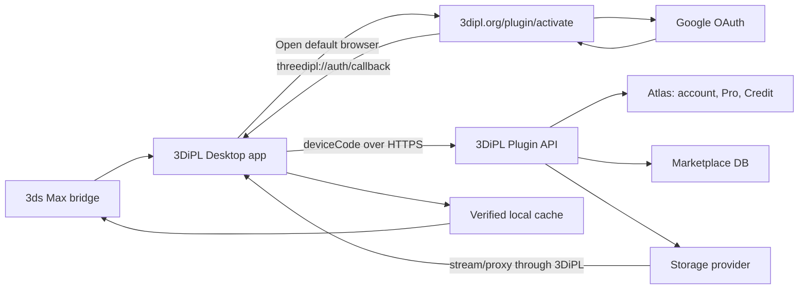

# 3DiPL Plugin Contract V2

Tài liệu này là contract mục tiêu cho `3DiPL Asset Manager` và bridge 3ds Max.
Nó thay thế mô tả đăng nhập và tải file cũ trong
`3DS_MAX_PLUGIN_DEVELOPMENT_GUIDE.md`.

Contract mục tiêu:

- Desktop release: `0.4.0` trở lên.
- Bridge protocol: `2`.
- Đăng nhập: app mở trình duyệt, website đăng nhập Google, sau đó gọi ngược app.
- Tải: người dùng chọn quota Free/Pro hoặc Credit, backend cấp download session.
- Production: file đi qua endpoint tải của 3DiPL, không mở trang Google Drive.

> **Trạng thái triển khai:** backend hiện đã có device authorization, Bearer token,
> Google login trên web, download options, quota/Credit, idempotency, challenge và
> download session. Phần callback `threedipl://` và việc giữ `appState` xuyên suốt
> Google OAuth là contract mới, phải hoàn thiện ở backend/frontend/plugin trước khi
> phát hành `0.4.0`.

## 1. Nguồn chuẩn

Khi tài liệu và code hiện tại khác nhau:

1. Tài liệu này là contract mục tiêu của protocol `2`.
2. `backend/src/routes/pluginRoutes.js` là route Bearer đã triển khai.
3. `backend/src/routes/pluginActivationRoutes.js` là activation/challenge trên web.
4. `backend/src/services/pluginAuthService.js` quản lý device session và token.
5. `backend/src/utils/marketplaceDownloadService.js` quản lý quota, Credit và session.
6. `backend/test/plugin-*.test.js` là regression contract hiện hành.

Mọi thay đổi contract phải cập nhật code, test và tài liệu trong cùng một PR.

## 2. Kiến trúc



Plugin không được:

- nhúng Google OAuth secret, Drive credential hoặc server secret;
- đăng nhập Google trong embedded WebView;
- đọc cookie website;
- nhận Google access token, Google ID token hoặc plugin refresh token qua deep link;
- lưu signed download URL hoặc query token vào log.

## 3. Base URL và header

| Môi trường | Base URL |
|---|---|
| Production | `https://3dipl.org` |
| Staging | `https://staging.3dipl.org` |
| Development | `http://127.0.0.1:<PORT>` |

Header chung:

```http
Accept: application/json
User-Agent: 3DiPL-AssetManager/0.4.0 (3ds Max 2026; Windows)
X-Correlation-Id: <8-96 safe characters>
X-3DiPL-Plugin-Version: 0.4.0
X-3DiPL-Max-Version: 2026
```

Route private thêm:

```http
Authorization: Bearer <accessToken>
```

Plugin API fail-closed. Nếu `PLUGIN_API_ENABLED` khác `true`, route plugin trả
`503 PLUGIN_API_DISABLED`.

Error envelope:

```json
{
  "message": "Safe message",
  "code": "MACHINE_READABLE_CODE",
  "details": {},
  "correlationId": "uuid"
}
```

Client xử lý theo `code`, không parse `message`.

## 4. Đăng nhập bằng Google qua trình duyệt

### 4.1 Nguyên tắc

Luồng đăng nhập là device authorization có app callback:

1. App tạo `appState` ngẫu nhiên và gọi device start.
2. App mở URL activation bằng trình duyệt mặc định.
3. Nếu browser chưa đăng nhập website, website chuyển tới Google OAuth.
4. Google callback trở lại đúng trang activation và giữ nguyên mã thiết bị.
5. User xác nhận kết nối thiết bị.
6. Website gọi `threedipl://auth/callback` để chuyển về app.
7. App kiểm tra `appState`, sau đó đổi `deviceCode` lấy plugin token qua HTTPS.

Deep link chỉ là tín hiệu đánh thức app. Token thật luôn đi qua HTTPS response.

### 4.2 Tạo yêu cầu đăng nhập

App tạo:

- `deviceId`: random 32 byte, ổn định theo lần cài và lưu bằng DPAPI;
- `appState`: random 32 byte cho mỗi lần đăng nhập, chỉ giữ trong memory;
- `deviceName`: tên hiển thị của máy;
- version của Desktop và 3ds Max.

```http
POST /api/plugin/auth/device/start
Content-Type: application/json

{
  "deviceId": "<installation-id>",
  "deviceName": "WORKSTATION-01",
  "pluginVersion": "0.4.0",
  "maxVersion": "2026",
  "callbackMode": "app",
  "appState": "<base64url-random>"
}
```

Response `201`:

```json
{
  "deviceCode": "<opaque-secret>",
  "userCode": "ABCD-EFGH",
  "verificationUri": "https://3dipl.org/plugin/activate",
  "verificationUriComplete": "https://3dipl.org/plugin/activate?code=ABCD-EFGH&app=1&state=<appState>",
  "appCallbackUri": "threedipl://auth/callback",
  "expiresIn": 600,
  "interval": 5
}
```

`deviceCode` là secret và không được đưa vào browser URL. `appState` là nonce công
khai để chống callback nhầm/replay: browser mang state, backend chỉ cần lưu hash để
đối chiếu với authorization trước khi hoàn tất.

### 4.3 Google login trên web

App mở `verificationUriComplete` bằng default browser. Trang activation phải giữ
được `code`, `app=1` và state server-side khi chuyển qua:

```http
GET /api/auth/google?returnTo=%2Fplugin%2Factivate%3Fcode%3DABCD-EFGH%26app%3D1%26state%3D%3CappState%3E
```

Sau Google OAuth:

- website tạo cookie phiên web như bình thường;
- Google token không được gửi sang app;
- website hiển thị tài khoản Google, thiết bị, phiên bản plugin và Max;
- user phải bấm `Cho phép` hoặc `Từ chối`.

Website không được tự approve chỉ vì Google login thành công.

### 4.4 Callback về app

Sau approve, website chuyển tới URI cố định:

```text
threedipl://auth/callback?status=approved&state=<appState>&code=ABCD-EFGH
```

Các trạng thái hợp lệ:

- `approved`
- `denied`
- `expired`
- `cancelled`

Yêu cầu bảo mật:

- chỉ cho phép scheme cố định `threedipl` và host `auth`;
- không nhận callback URI tùy ý từ client;
- callback không chứa access token, refresh token, email hoặc Google token;
- app so sánh `state` bằng constant-time comparison;
- state sai hoặc không còn login pending phải bị bỏ qua;
- callback chỉ được xử lý một lần.

Installer đăng ký protocol cho Desktop app theo user hiện tại. Không dùng
`3dipl://` vì URI scheme chuẩn phải bắt đầu bằng chữ cái.

Nếu protocol handler không mở được, trang web hiện nút `Mở 3DiPL app` và thông báo
app vẫn đang chờ. App tiếp tục poll nên callback bị chặn không làm hỏng login.

### 4.5 Đổi device code lấy token

App poll từ lúc mở browser và gọi ngay khi nhận callback:

```http
POST /api/plugin/auth/device/token
Content-Type: application/json

{ "deviceCode": "<opaque-secret>" }
```

Không poll nhanh hơn `interval`.

Trạng thái chờ:

| Code | Hành vi |
|---|---|
| `AUTHORIZATION_PENDING` | Tiếp tục chờ. |
| `SLOW_DOWN` | Tăng interval và tôn trọng `Retry-After`. |
| `ACCESS_DENIED` | Dừng và xóa login pending. |
| `EXPIRED_TOKEN` | Dừng, yêu cầu đăng nhập lại. |

Response thành công:

```json
{
  "accessToken": "<jwt>",
  "expiresIn": 900,
  "refreshToken": "<opaque>",
  "refreshExpiresAt": "2026-09-30T00:00:00.000Z",
  "sessionId": "<id>",
  "user": {
    "id": "<id>",
    "name": "User",
    "avatar": "https://...",
    "isPro": true,
    "proUntil": "...",
    "credit": 100,
    "downloadQuota": {
      "used": 3,
      "limit": 100,
      "remaining": 97,
      "resetAt": "..."
    }
  }
}
```

Access token chỉ giữ trong memory. Refresh token lưu bằng Windows DPAPI
`CurrentUser`, không lưu plaintext trong JSON, SQLite hoặc log.

### 4.6 Refresh, account và logout

```http
POST   /api/plugin/auth/refresh
GET    /api/plugin/me
DELETE /api/plugin/auth/session
```

Refresh token rotate ở mỗi lần refresh. App phải persist token mới thành công rồi
mới bỏ token cũ. Replay token cũ sẽ revoke device session.

App gọi `/api/plugin/me` khi:

- khởi động;
- cửa sổ app được focus lại;
- user vừa nạp Credit hoặc mua Pro trên web;
- download hoàn tất;
- tối đa mỗi 30-60 giây khi app đang mở.

Như vậy số dư và Pro cập nhật mà không cần F5 hoặc đóng app.

## 5. Catalog

Catalog public dùng các route website hiện tại:

```http
GET /api/marketplace/models
GET /api/marketplace/scenes
GET /api/marketplace/models/:slug-or-id
GET /api/marketplace/scenes/:slug-or-id
GET /api/marketplace/categories
GET /api/marketplace/scenes/categories
GET /api/marketplace/filters
GET /api/marketplace/scenes/filters
GET /api/marketplace/taxonomy/export?assetType=all
```

Client hỗ trợ URL ảnh tương đối và nối với base URL. Không dùng URL ảnh hoặc Drive
ID làm định danh. ID chuẩn là `_id`; route detail có thể dùng slug.

Wire value của quyền tài nguyên là:

- `free`: tài nguyên Free;
- `member`: tài nguyên Pro, UI hiển thị `PRO`.

Card dùng cover. Gallery và hover dùng `previewImages[0]`, tức preview đầu tiên sau
khi backend đã loại cover khỏi danh sách preview.

Cache catalog/taxonomy theo `ETag`. Khi offline chỉ cho xem snapshot và file cache,
không tạo download session mới.

## 6. Cơ chế tải mới

### 6.1 Giá và phương thức

Backend là nguồn giá duy nhất. Giá mặc định hiện tại:

| Tài nguyên | Quota cost | Credit cost mặc định |
|---|---:|---:|
| Model | 1 | 5 |
| Scene | 5 | 25 |

Admin có thể thay đổi giá Credit. Plugin không hard-code giá để tính giao dịch.

Phương thức:

- `free_quota`: user Free tải tài nguyên Free;
- `pro_quota`: user Pro tải tài nguyên Free hoặc Pro;
- `credit`: user Free/Pro tải lẻ tài nguyên Free hoặc Pro.

Credit không trừ quota. Quota không trừ Credit. Một lần charge Credit cho phép tải
lại cùng asset trong đúng 24 giờ trên cả web và plugin.

### 6.2 Lấy download options

```http
GET /api/plugin/models/:id/download-options
GET /api/plugin/scenes/:id/download-options
Authorization: Bearer <accessToken>
```

Ví dụ Model Pro, user Free có 20 Credit:

```json
{
  "assetType": "model",
  "accessType": "member",
  "quotaCost": 1,
  "creditPrice": 5,
  "creditBalance": 20,
  "entitlementUntil": null,
  "defaultMethod": "credit",
  "quota": {
    "tier": "free",
    "used": 0,
    "limit": 5,
    "remaining": 5,
    "resetAt": "..."
  },
  "options": [
    {
      "method": "free_quota",
      "available": false,
      "cost": 1,
      "remaining": 5,
      "reason": "PRO_REQUIRED"
    },
    {
      "method": "credit",
      "available": true,
      "cost": 5,
      "configuredCost": 5,
      "balance": 20,
      "reason": ""
    }
  ]
}
```

Plugin phải render đúng `options`; không tự suy ra phương thức từ badge Free/Pro.
Nếu entitlement 24 giờ còn hiệu lực, `credit.cost` bằng `0` và
`defaultMethod="credit"`.

### 6.3 Chọn phương thức

- User Free + asset Free: chọn Free quota hoặc Credit.
- User Free + asset Pro: chọn Credit hoặc mở `/topup?mode=pro`.
- User Pro: mặc định Pro quota nhưng vẫn có thể chọn Credit.
- Hết quota: vẫn tải bằng Credit nếu đủ số dư.
- Thiếu Credit: mở `/topup?mode=credit` bằng browser.

Plugin không được tự fallback sang phương thức khác sau khi user đã xác nhận.

### 6.4 Tạo download session

```http
POST /api/plugin/models/:id/download-session
POST /api/plugin/scenes/:id/download-session
Authorization: Bearer <accessToken>
Idempotency-Key: <operation-id>
Content-Type: application/json

{
  "paymentMethod": "credit"
}
```

`Idempotency-Key`:

- bắt buộc cho plugin;
- dài `8..128`, chỉ gồm `[A-Za-z0-9._:-]`;
- tạo mới cho mỗi thao tác user chủ động;
- giữ nguyên khi retry cùng thao tác;
- không dùng lại cho asset khác.

Response:

```json
{
  "session": {
    "_id": "<session-id>",
    "expiresAt": "...",
    "fileName": "chair.zip",
    "fileSize": 104857600,
    "sha256": "<64-hex>",
    "assetRevision": "<revision>",
    "mainMaxFile": "chair/chair.max",
    "archiveFormat": "zip"
  },
  "downloadUrl": "/api/plugin/download/session/<id>/file?t=<token>",
  "remaining": 5,
  "quotaCost": 0,
  "resetAt": "...",
  "paymentMethod": "credit",
  "billingStatus": "pending",
  "creditCost": 5,
  "creditEntitlementUntil": null
}
```

Thời điểm tính tiền:

- Free/Pro quota được giữ và trừ khi tạo session thành công.
- Credit mới chỉ là quote khi tạo session.
- Credit được charge khi backend đã xác minh storage và bắt đầu cấp byte file.
- Storage lỗi trước bước charge không làm mất Credit.
- Retry dùng cùng operation/session không charge lần hai.
- Entitlement 24 giờ là nguồn chống trừ lặp giữa web và plugin.

### 6.5 Browser challenge

Session rủi ro có thể trả `403 CHALLENGE_REQUIRED`:

```json
{
  "code": "CHALLENGE_REQUIRED",
  "details": {
    "challengeToken": "<one-time-token>",
    "challengeUrl": "https://3dipl.org/plugin/challenge?code=<code>",
    "expiresIn": 600
  }
}
```

App mở `challengeUrl`, user xác minh trên web, sau đó retry đúng asset,
`Idempotency-Key`, payment method và gửi `challengeToken`. Token gắn với
user/device/asset/operation và chỉ dùng một lần.

### 6.6 Nhận file qua 3DiPL

```http
GET /api/plugin/download/session/:id/file?t=<download-token>
Authorization: Bearer <accessToken>
Range: bytes=<offset>-
```

Contract Production mới:

- app gọi endpoint 3DiPL, không mở browser để tải;
- backend stream/proxy file từ storage về client;
- response là `200` hoặc `206`;
- không trả trang cảnh báo virus Google Drive;
- không để lộ Drive file ID hoặc Drive URL cho UI/log;
- filename lấy từ `Content-Disposition` hoặc `session.fileName`.

Client vẫn phải xử lý việc session hết hạn bằng cách xin session mới với operation
mới. Không nối URL storage thủ công.

### 6.7 Download manager

1. Ghi vào `<file>.partial`.
2. Resume chỉ khi server trả `Accept-Ranges: bytes`.
3. Nếu server trả `200` cho request Range, xóa partial và tải lại từ đầu.
4. Sau khi hoàn tất, kiểm tra đúng `fileSize` và SHA-256.
5. Chỉ rename file và giải nén sau khi verify thành công.
6. Safe extract chặn Zip Slip, symlink, reparse point và path thoát cache.
7. Giới hạn số file, kích thước giải nén và độ dài path.
8. Không chạy `.exe`, `.bat`, `.cmd`, `.ps1` hoặc DLL lấy từ archive.
9. Gọi `/api/plugin/me` để cập nhật ngay Credit/quota.

Cache key:

```text
{assetType}/{assetId}/{assetRevision}/
```

`assetRevision` đổi thì không tái sử dụng archive cũ.

## 7. Model và Scene sau khi tải

Model:

- verify và giải nén;
- dùng `mainMaxFile` nếu có;
- merge trên main thread của 3ds Max;
- không tự sửa render setting hoặc move object nếu metadata không yêu cầu.

Scene:

- không merge mặc định;
- cảnh báo nếu scene hiện tại chưa lưu;
- copy file từ cache sang thư mục làm việc;
- mở bản copy, không ghi đè cache.

Nếu `mainMaxFile` trống:

1. một file `.max`: dùng file đó;
2. nhiều file: hiển thị selector;
3. không đoán ngẫu nhiên.

## 8. Error handling

| HTTP/code | Hành vi client |
|---|---|
| `401 BEARER_TOKEN_REQUIRED` | Gửi Bearer token. |
| `401 INVALID_ACCESS_TOKEN` | Refresh đúng một lần rồi retry. |
| `401 INVALID_REFRESH_TOKEN` | Xóa session local, đăng nhập lại. |
| `401 REFRESH_REPLAY` | Xóa session; device đã bị revoke. |
| `401 SESSION_REVOKED` | Đăng nhập lại. |
| `402 INSUFFICIENT_CREDIT` | Hiện số cần/còn và mở nạp Credit. |
| `403 PRO_REQUIRED` | Mở mua Pro hoặc chọn Credit. |
| `403 CHALLENGE_REQUIRED` | Mở browser challenge. |
| `400 PAYMENT_METHOD_NOT_ALLOWED` | Tải lại options. |
| `409 IDEMPOTENCY_KEY_REUSED` | Tạo operation mới. |
| `409 IDEMPOTENCY_OPERATION_EXPIRED` | Tạo session mới. |
| `410` session expired | Xin session mới. |
| `429 DOWNLOAD_QUOTA_EXCEEDED` | Hiện reset time và phương thức Credit. |
| `429 RATE_LIMITED` | Tôn trọng `Retry-After`. |
| `5xx` | Backoff có jitter, tối đa 3 lần. |

Không retry tự động lỗi thanh toán bằng phương thức khác.

## 9. Release và update

```http
GET /api/plugin/release
If-None-Match: "<etag>"
```

Client chỉ nhận update khi:

- channel và semantic version hợp lệ;
- Max version được hỗ trợ;
- protocol range chứa protocol hiện tại;
- URL là HTTPS đúng origin cho phép;
- SHA-256 đúng;
- ES256 signature của component và manifest đúng;
- Desktop artifact có Authenticode hợp lệ.

Update Desktop tương thích có thể không cần restart Max. Update bridge yêu cầu
restart Max.

## 10. Biến môi trường server

| Biến | Yêu cầu Production |
|---|---|
| `PLUGIN_API_ENABLED` | `true` sau khi Staging E2E pass. |
| `PLUGIN_RELEASE_ENABLED` | `false` khi đang phát triển; chỉ bật sau khi mọi artifact đã ký. |
| `PLUGIN_JWT_SECRET` | Secret riêng tối thiểu 32 ký tự. |
| `PLUGIN_DOWNLOAD_CHALLENGE_MODE` | `risk`. |
| `PLUGIN_DOWNLOAD_CHALLENGE_TRUST_HOURS` | `168`; session đã xác minh chỉ bị hỏi lại khi có rủi ro mới sau thời hạn. |
| `PLUGIN_RELEASE_CHANNEL` | `production`. |
| `PLUGIN_RELEASE_VERSION` | Phiên bản phát hành. |
| `PLUGIN_MINIMUM_VERSION` | Phiên bản tối thiểu. |
| `PLUGIN_RELEASE_MANIFEST_VERSION` | `2`. |
| `PLUGIN_RELEASE_PUBLIC_KEY` | ES256 SPKI public key được pin. |
| `PLUGIN_DESKTOP_RELEASE_*` | URL, SHA, signature, time, protocol range. |
| `PLUGIN_MAX_BRIDGE_RELEASE_*` | URL, SHA, signature, time, protocol range. |
| `PLUGIN_DEPLOYMENT_ENV` | `production`. |
| `PLUGIN_QA_RISK_SECRET` | Không tồn tại ở Production. |
| `MARKETPLACE_DOWNLOAD_DELIVERY` | Chế độ proxy/stream qua 3DiPL cho plugin Production. |

Không commit `.env`, JWT secret, Google credential, refresh token, Turnstile secret,
Authenticode certificate hoặc ES256 private key.

## 11. Trạng thái triển khai protocol 2

Source protocol 2 đã hoàn tất ở Desktop, backend, frontend và installer. Các mục
dưới đây là contract đã được triển khai và được bảo vệ bằng unit/integration test.
Trong giai đoạn tích hợp có thể bật `PLUGIN_API_ENABLED=true` để dùng auth/catalog/
download và giữ `PLUGIN_RELEASE_ENABLED=false`. Khi đó riêng `/api/plugin/release`
trả `503 PLUGIN_RELEASE_DISABLED`. Chỉ bật release feed sau khi hoàn tất ký artifact,
Staging E2E và checklist phê duyệt triển khai.

Backend đã triển khai:

- nhận và validate `callbackMode`, `appState`, `deviceId` ở device start;
- chỉ lưu hash của state/device ID khi phù hợp;
- bảo toàn activation context qua Google OAuth;
- trả callback state đúng authorization sau approve/deny;
- không cho callback URI tùy ý;
- bảo đảm plugin file endpoint dùng proxy/stream ở Production;
- thêm test callback replay, state mismatch và OAuth return preservation.

Frontend web đã triển khai:

- trang activation tự đưa guest qua Google login và quay lại đúng code;
- hiển thị tài khoản Google trước khi approve;
- sau approve gọi `threedipl://auth/callback`;
- có nút mở app lại và fallback khi protocol handler không tồn tại;
- không hiển thị hoặc log token.

Desktop app/installer đã triển khai:

- đăng ký protocol `threedipl://` bằng installer;
- chỉ chấp nhận `threedipl://auth/callback`;
- single-instance chuyển callback vào process đang chạy;
- kiểm tra state và login pending;
- tiếp tục polling làm fallback;
- lưu refresh token bằng DPAPI;
- triển khai download options và payment selector;
- stream vào partial, resume, SHA-256 và safe extract.

## 12. Acceptance tests

Authentication:

- browser chưa login, Google login xong quay lại activation;
- browser đã login, vẫn yêu cầu approve thiết bị;
- approve gọi đúng app và app nhận đúng account;
- deep link bị chặn nhưng polling vẫn đăng nhập được;
- state sai/replay/expired không tạo session;
- refresh rotate và replay revoke session;
- logout/revoke trên web làm app mất quyền.

Download:

- Free tải Model Free bằng 1 quota;
- Free tải Scene Free bằng 5 quota;
- Free tải asset Pro bằng Credit;
- Pro chọn được Pro quota hoặc Credit;
- Model Credit dùng giá backend, mặc định 5;
- Scene Credit dùng giá backend, mặc định 25;
- entitlement 24 giờ không charge lại trên web/plugin;
- thiếu Credit không tạo debit;
- storage lỗi trước delivery không trừ Credit;
- hai request đồng thời cùng operation chỉ charge một lần;
- file tải qua 3DiPL, không mở hoặc lộ Google Drive;
- resume, session expiry, SHA mismatch và safe extraction;
- `/me` cập nhật số dư/quota sau tải và sau khi quay lại từ topup.

Release:

- ETag/304;
- SHA-256, ES256, Authenticode;
- protocol không tương thích bị từ chối;
- test riêng từng phiên bản 3ds Max phát hành.

Các test backend tối thiểu:

```text
backend/test/plugin-auth.test.js
backend/test/plugin-download-challenge.test.js
backend/test/plugin-download-idempotency.test.js
backend/test/plugin-rate-limit-contract.test.js
backend/test/plugin-release-etag.test.js
backend/test/plugin-release-signature.test.js
```
